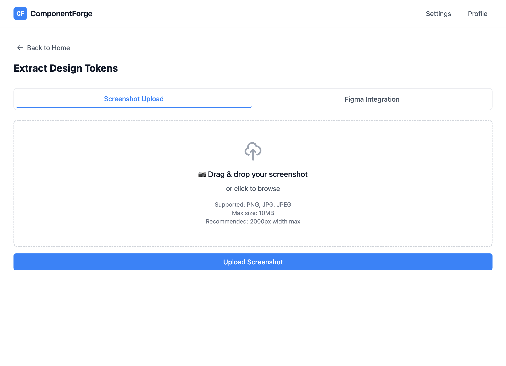

# Epic 1: Design Token Extraction

**Status**: Not Started
**Priority**: High
**Epic Owner**: AI/ML Team
**Estimated Tasks**: 10
**Depends On**: Epic 0 (Project Setup)

---

## Overview

Build a robust design token extraction system that processes both Figma files and screenshots to extract colors, typography, and spacing tokens with confidence scoring. The system must handle extraction failures gracefully and provide manual override capabilities.

---

## Goals

1. Extract design tokens from screenshots using GPT-4V
2. Extract design tokens from Figma files via API (PAT authentication)
3. Provide confidence scores for all extractions
4. Enable manual review and override of extracted tokens
5. Fallback to shadcn/ui defaults when confidence <0.7
6. Export tokens in multiple formats (JSON, CSS variables)
7. Cache Figma API responses to reduce costs and latency
8. Handle rate limits and API errors gracefully

---

## Success Criteria

- ✅ Screenshot upload supports PNG/JPG up to 10MB
- ✅ Extract colors (primary, background, foreground) with hex values
- ✅ Extract typography (font family, size, weight) accurately
- ✅ Extract spacing patterns (4px base unit multiples)
- ✅ Confidence score (0-1) displayed for each token
- ✅ Fallback to shadcn/ui defaults when confidence <0.7
- ✅ Figma PAT authentication works correctly
- ✅ Figma API cache reduces repeat calls (5 min TTL)
- ✅ Token extraction completes within 10 seconds
- ✅ Manual override UI allows editing all token values
- ✅ Export tokens as JSON and CSS custom properties

---

## Wireframe

### Interactive Prototype
**View HTML:** [token-extraction-page.html](../wireframes/token-extraction-page.html)



### Key UI Elements

**Screenshot Tab** (Default view)
- Drag-and-drop upload zone → Task 1: Screenshot Upload & Validation
- Progress indicator with stages → Task 2: GPT-4V Extraction
- Confidence badges (color-coded) → Task 6: Confidence Scoring & Fallback
- Token display sections (Colors, Typography, Spacing) → Tasks 2, 6

**Figma Tab**
- PAT input field with validation → Task 3: Figma PAT Authentication
- File URL input → Task 4: Figma File & Styles Extraction
- Cache indicator (5 min TTL) → Task 5: Figma Response Caching

**Token Editor**
- Inline editing controls → Task 7: Manual Token Override UI
- Color pickers, font selectors, number inputs → Task 7
- Export buttons (JSON/CSS) → Task 8: Token Export

**States Shown**
- Upload zone (hover, drag-over states)
- Extraction progress (loading with percentage)
- Error messages → Task 9: Error Handling & Rate Limiting
- Confidence badges (✅ ≥0.9, ⚠️ 0.7-0.9, 🔴 <0.7)

### User Flow
1. User selects Screenshot or Figma tab
2. Uploads design asset or enters Figma credentials
3. System extracts tokens (shows real-time progress)
4. Displays extracted tokens with confidence scores
5. User reviews and manually edits if needed
6. Exports tokens as JSON or CSS variables

**Quick Test:**
```bash
# View wireframe locally
open .claude/wireframes/token-extraction-page.html
```

---

## User Stories

### Story 1.1: Screenshot Token Extraction
**As a** frontend developer
**I want to** upload a design system screenshot
**So that** I can automatically extract colors, typography, and spacing tokens

### Story 1.2: Figma Integration
**As a** frontend developer
**I want to** connect my Figma design file
**So that** I can extract accurate tokens without screenshots

### Story 1.3: Token Validation & Override
**As a** design system team member
**I want to** review and edit extracted tokens
**So that** I can ensure accuracy before generation

---

## Tasks

### Task 1: Implement Screenshot Upload & Validation
**Acceptance Criteria**:
- [ ] API endpoint: `POST /api/v1/tokens/extract/screenshot`
- [ ] Accept PNG, JPG, JPEG formats
- [ ] File size limit: 10MB
- [ ] Image validation (dimensions, format, corruption)
- [ ] Resize/normalize images (max 2000px width)
- [ ] Return error for invalid uploads with clear message
- [ ] Store uploaded images temporarily (1 hour TTL)

**Files**:
- `backend/src/api/v1/routes/tokens.py`
- `backend/src/services/image_processor.py`
- `app/src/app/api/tokens/upload/route.ts`

**Tests**:
- Valid image upload succeeds
- Oversized image rejected
- Invalid format rejected
- Corrupted image rejected

---

### Task 2: GPT-4V Vision-Based Token Extraction
**Acceptance Criteria**:
- [ ] LangChain prompt for token extraction from screenshots
- [ ] Extract colors (hex format):
  - Primary color
  - Background color
  - Foreground/text color
  - Secondary colors (if present)
- [ ] Extract typography:
  - Font family (inferred from visual)
  - Font sizes (px values)
  - Font weights (100-900)
- [ ] Extract spacing:
  - Padding values
  - Gap/margin values
  - Base unit detection (4px, 8px system)
- [ ] Return structured JSON with confidence per token
- [ ] Handle GPT-4V API errors with retries (3 attempts)

**Files**:
- `backend/src/agents/token_extractor.py`
- `backend/src/prompts/token_extraction.py`

**Prompt Template**:
```python
"""
Analyze this design system screenshot and extract design tokens.

Return a JSON object with:
{
  "colors": {
    "primary": {"value": "#HEX", "confidence": 0.0-1.0},
    "background": {"value": "#HEX", "confidence": 0.0-1.0},
    "foreground": {"value": "#HEX", "confidence": 0.0-1.0}
  },
  "typography": {
    "fontFamily": {"value": "string", "confidence": 0.0-1.0},
    "fontSize": {"value": "16px", "confidence": 0.0-1.0},
    "fontWeight": {"value": 500, "confidence": 0.0-1.0}
  },
  "spacing": {
    "padding": {"value": "16px", "confidence": 0.0-1.0},
    "gap": {"value": "8px", "confidence": 0.0-1.0}
  }
}

Confidence guidelines:
- 0.9-1.0: Clearly visible and unambiguous
- 0.7-0.9: Visible but some interpretation needed
- <0.7: Unclear or guessed
"""
```

**Tests**:
- Button screenshot extracts correct colors
- Typography values match design
- Spacing follows grid system
- Confidence scores are reasonable

---

### Task 3: Figma PAT Authentication
**Acceptance Criteria**:
- [ ] API endpoint: `POST /api/v1/tokens/figma/auth`
- [ ] Accept Figma Personal Access Token (PAT)
- [ ] Validate token with Figma API (`GET /v1/me`)
- [ ] Store token securely in environment/vault
- [ ] Return authentication status (valid/invalid)
- [ ] Handle invalid token with clear error message
- [ ] Support token refresh/update

**Files**:
- `backend/src/services/figma_client.py`
- `app/src/lib/api/figma.ts`

**Security**:
- Never log PAT in plaintext
- Store in environment variables or secrets manager
- Validate token format before API call

**Tests**:
- Valid PAT authentication succeeds
- Invalid PAT returns error
- Token stored securely

---

### Task 4: Figma File & Styles Extraction
**Acceptance Criteria**:
- [ ] API endpoint: `POST /api/v1/tokens/extract/figma`
- [ ] Accept Figma file URL (figma.com/file/xxx format)
- [ ] Validate URL format
- [ ] Fetch file using Figma API:
  - `GET /v1/files/:key` (structure)
  - `GET /v1/files/:key/styles` (local styles)
- [ ] Extract color styles → hex values
- [ ] Extract text styles → font family, size, weight
- [ ] Extract auto-layout → spacing tokens
- [ ] Return normalized token JSON
- [ ] Handle Figma API errors (rate limit, invalid file, permissions)

**Files**:
- `backend/src/services/figma_client.py`
- `backend/src/agents/figma_extractor.py`

**Figma API Calls**:
```python
# Get file structure
GET https://api.figma.com/v1/files/{file_key}
Headers: X-Figma-Token: {pat}

# Get styles
GET https://api.figma.com/v1/files/{file_key}/styles
Headers: X-Figma-Token: {pat}
```

**Tests**:
- Valid Figma file extracts tokens
- Invalid file URL returns error
- Rate limit handled with retry
- Missing permissions error clear

---

### Task 5: Figma Response Caching (L0 Cache)
**Acceptance Criteria**:
- [ ] Cache Figma API responses in Redis
- [ ] TTL: 5 minutes
- [ ] Cache key: `figma:file:{file_key}`
- [ ] Cache hit returns data in ~0.1s
- [ ] Cache miss fetches from Figma API
- [ ] Cache invalidation on manual refresh
- [ ] Metrics: cache hit rate, latency

**Files**:
- `backend/src/core/cache.py`
- `backend/src/services/figma_client.py`

**Cache Strategy**:
```python
async def get_figma_file(file_key: str) -> dict:
    cache_key = f"figma:file:{file_key}"

    # Check cache
    cached = await redis.get(cache_key)
    if cached:
        return json.loads(cached)

    # Fetch from API
    response = await figma_api.get_file(file_key)

    # Store in cache
    await redis.setex(cache_key, 300, json.dumps(response))

    return response
```

**Tests**:
- Cache hit returns correct data
- Cache miss fetches and stores
- TTL expires correctly
- Cache invalidation works

---

### Task 6: Confidence Scoring & Fallback Logic
**Acceptance Criteria**:
- [ ] Calculate confidence for each token (0-1 scale)
- [ ] Confidence threshold: 0.7
- [ ] Auto-accept tokens with confidence ≥0.9
- [ ] Flag for review: 0.7 ≤ confidence < 0.9
- [ ] Fallback to shadcn/ui defaults: confidence <0.7
- [ ] Display confidence visually in UI (color coding)
- [ ] Log low-confidence extractions for analysis

**Files**:
- `backend/src/core/confidence.py`
- `backend/src/core/defaults.py`

**Fallback Defaults** (shadcn/ui):
```json
{
  "colors": {
    "primary": "#3B82F6",
    "background": "#FFFFFF",
    "foreground": "#09090B"
  },
  "typography": {
    "fontFamily": "Inter",
    "fontSize": "16px",
    "fontWeight": 500
  },
  "spacing": {
    "padding": "16px",
    "gap": "8px"
  }
}
```

**Tests**:
- Confidence ≥0.9 auto-accepted
- Confidence <0.7 uses defaults
- Fallback values match shadcn/ui

---

### Task 7: Manual Token Override UI
**Acceptance Criteria**:
- [ ] Display extracted tokens in editable form
- [ ] Color picker for hex colors
- [ ] Dropdown for font families (web-safe + custom)
- [ ] Number input for font sizes/weights
- [ ] Input validation:
  - Colors: Valid hex (#RRGGBB)
  - Font sizes: Standard values (12, 14, 16, 18, 20, 24px)
  - Font weights: 100-900 in increments of 100
- [ ] Save button commits changes
- [ ] Reset button restores extracted values
- [ ] Show confidence score per token

**Files**:
- `app/src/components/tokens/TokenEditor.tsx`
- `app/src/components/tokens/ColorPicker.tsx`
- `app/src/components/tokens/TypographyEditor.tsx`

**UI Components**:
```tsx
<TokenEditor>
  <ColorSection>
    <ColorPicker label="Primary" value="#3B82F6" confidence={0.92} />
    <ColorPicker label="Background" value="#FFFFFF" confidence={0.88} />
  </ColorSection>

  <TypographySection>
    <FontFamilySelect value="Inter" confidence={0.75} />
    <FontSizeInput value="16px" confidence={0.90} />
  </TypographySection>

  <SpacingSection>
    <SpacingInput label="Padding" value="16px" confidence={0.85} />
  </SpacingSection>
</TokenEditor>
```

**Tests**:
- UI displays extracted tokens
- Edits save correctly
- Validation rejects invalid values
- Confidence displayed visually

---

### Task 8: Token Export (JSON & CSS)
**Acceptance Criteria**:
- [ ] Export as JSON:
  ```json
  {
    "colors": {"primary": "#3B82F6"},
    "typography": {"fontSize": "16px"}
  }
  ```
- [ ] Export as CSS custom properties:
  ```css
  :root {
    --color-primary: #3B82F6;
    --font-size-base: 16px;
  }
  ```
- [ ] Download buttons for both formats
- [ ] Copy to clipboard functionality
- [ ] Include metadata (extraction method, confidence, timestamp)

**Files**:
- `backend/src/services/token_exporter.py`
- `app/src/components/tokens/TokenExport.tsx`

**Tests**:
- JSON export format correct
- CSS export format correct
- Download triggers file save
- Clipboard copy works

---

### Task 9: Error Handling & Rate Limiting
**Acceptance Criteria**:
- [ ] Handle Figma API rate limits:
  - 1,000 requests/hour limit
  - Exponential backoff on 429 errors
  - Queue requests if near limit
- [ ] Handle OpenAI rate limits:
  - 10,000 RPM (Tier 2)
  - Retry with exponential backoff
- [ ] Handle network errors (timeout, connection)
- [ ] User-friendly error messages:
  - "Figma API limit reached. Try again in X minutes."
  - "Image upload failed. Please use PNG/JPG under 10MB."
- [ ] Log all errors with context (file key, user ID, timestamp)

**Files**:
- `backend/src/core/errors.py`
- `backend/src/core/rate_limiter.py`

**Rate Limit Strategy**:
```python
class RateLimiter:
    async def check_limit(self, service: str):
        key = f"rate_limit:{service}"
        count = await redis.incr(key)
        if count == 1:
            await redis.expire(key, 3600)  # 1 hour

        if count > LIMITS[service]:
            raise RateLimitError(f"{service} limit exceeded")
```

**Tests**:
- Rate limit triggers retry
- Exponential backoff works
- Error messages are clear
- All errors logged

---

### Task 10: Integration Testing & Metrics
**Acceptance Criteria**:
- [ ] End-to-end test: Screenshot → tokens → export
- [ ] End-to-end test: Figma → tokens → export
- [ ] Performance test: Extraction completes <10s
- [ ] Metrics tracked:
  - Extraction success rate
  - Average confidence score
  - Figma cache hit rate
  - Extraction latency (p50, p95, p99)
  - Fallback usage rate
- [ ] Dashboard displays metrics
- [ ] Alerts for high error rates

**Files**:
- `backend/tests/integration/test_token_extraction.py`
- `backend/src/monitoring/metrics.py`

**Tests**:
- Screenshot extraction end-to-end
- Figma extraction end-to-end
- Performance under target
- Metrics collected correctly

---

## Dependencies

**Requires**:
- Epic 0: Docker services (Redis, PostgreSQL)
- Epic 0: LangSmith tracing configured
- Epic 0: Environment variables set

**Blocks**:
- Epic 2: Requirement proposal (uses tokens as input)
- Epic 4: Code generation (uses tokens for injection)

---

## Technical Architecture

### Token Extraction Flow

```
┌─────────────┐
│   Client    │
│ (Upload UI) │
└──────┬──────┘
       │
       ↓
┌─────────────────────────────┐
│  API: POST /tokens/extract  │
│  - Screenshot or Figma URL  │
└──────────┬──────────────────┘
           │
           ↓
    ┌──────────────┐
    │ Image Valid? │
    └──┬───────┬───┘
       │ Yes   │ No → Error
       ↓       ↓
┌──────────────┐  ┌──────────────┐
│ Screenshot?  │  │  Figma URL?  │
└──┬───────────┘  └──┬───────────┘
   │                 │
   ↓                 ↓
┌──────────────┐  ┌──────────────────┐
│ GPT-4V       │  │ Check Cache (L0) │
│ Vision API   │  └──┬───────────────┘
└──┬───────────┘     │ Hit │ Miss
   │                 ↓     ↓
   │              (return) Figma API
   │                       │
   ↓                       ↓
┌─────────────────────────────────┐
│  Token Normalization            │
│  - Colors → hex                 │
│  - Typography → standard units  │
│  - Spacing → px values          │
└──────────────┬──────────────────┘
               │
               ↓
┌─────────────────────────────────┐
│  Confidence Scoring             │
│  - Calculate per token          │
│  - Flag for review if <0.9      │
│  - Fallback if <0.7             │
└──────────────┬──────────────────┘
               │
               ↓
┌─────────────────────────────────┐
│  Return to Client               │
│  {                              │
│    tokens: {...},               │
│    confidence: {...},           │
│    fallbacks: [...]             │
│  }                              │
└─────────────────────────────────┘
```

---

## Risks & Mitigation

| Risk | Impact | Mitigation |
|------|--------|------------|
| Figma API changes | High | Version API calls, monitor deprecations |
| GPT-4V inaccurate extraction | Medium | Human review required, confidence thresholds |
| Rate limits exceeded | Medium | Aggressive caching, queue system |
| Screenshot quality poor | Medium | Image preprocessing, quality checks |
| Color extraction fails | Low | Fallback to defaults, manual override |

---

## Definition of Done

- [ ] All 10 tasks completed with acceptance criteria met
- [ ] Screenshot extraction works with 90%+ accuracy
- [ ] Figma extraction works with 95%+ accuracy
- [ ] Confidence scoring implemented and tested
- [ ] Manual override UI functional
- [ ] Export formats (JSON, CSS) working
- [ ] Caching reduces Figma calls by 70%+
- [ ] Error handling graceful with clear messages
- [ ] Integration tests passing
- [ ] Metrics dashboard shows key stats
- [ ] Documentation updated

---

## Related Epics

- **Depends On**: Epic 0
- **Blocks**: Epic 2, Epic 4
- **Related**: Epic 6 (caching infrastructure)

---

## Notes

**Critical Path**: This epic is a prerequisite for requirement proposal and code generation. Prioritize completing screenshot extraction first (Tasks 1-2, 6-8) to unblock Epic 2.

**Figma Integration**: Tasks 3-5 can be done in parallel with screenshot tasks. Consider making Figma optional for MVP if timeline is tight.

**Performance Target**: 10-second extraction is aggressive. Monitor actual performance and adjust if needed (acceptable range: 10-15s).
