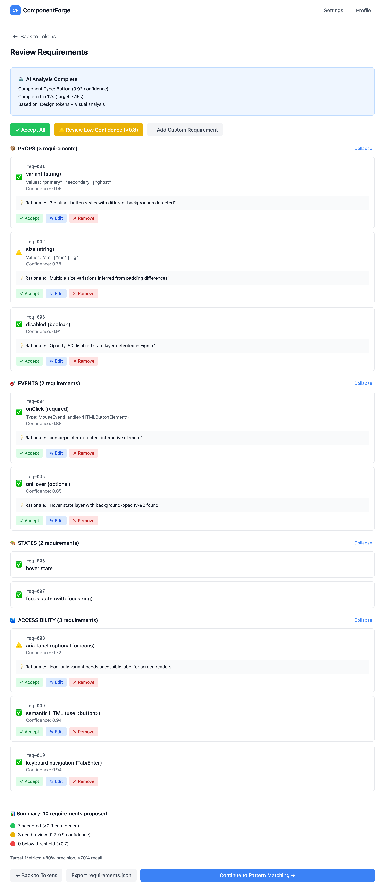

# Epic 2: Requirement Proposal & Review

**Status**: Not Started
**Priority**: High
**Epic Owner**: AI/ML Team
**Estimated Tasks**: 8
**Depends On**: Epic 1 (Design Token Extraction)

---

## Overview

Build an AI-powered system that analyzes screenshots and Figma frames to propose functional requirements (props, events, states, validation, accessibility) with confidence scores and human-in-the-loop approval before code generation.

---

## Goals

1. Infer component type from screenshot/Figma frame
2. Propose functional requirements across all categories
3. Generate confidence scores and rationales per requirement
4. Build editable approval panel UI
5. Export approved `requirements.json`
6. Feed requirements into retrieval and generation pipeline
7. Target p50 latency ≤15s for proposal

---

## Success Criteria

- ✅ Correctly identify component type (Button, Card, etc.) with 85%+ accuracy
- ✅ Propose requirements covering props, events, states, validation, a11y
- ✅ Confidence score (0-1) per requirement with rationale
- ✅ Editable approval panel allows accept/edit/remove
- ✅ Export `requirements.json` with approved items only
- ✅ Requirements used by Pattern Retrieval (Epic 3) and Code Generation (Epic 4)
- ✅ Proposal completes in ≤15s (p50)
- ✅ Achieve ≥80% precision, ≥70% recall on labeled eval set

---

## Wireframe

### Interactive Prototype
**View HTML:** [requirements-review-page.html](../wireframes/requirements-review-page.html)



### Key UI Elements

**AI Analysis Summary** (Top banner)
- Component type detection with confidence → Task 1: Component Type Inference
- Completion time display (target ≤15s) → Performance monitoring
- Analysis context (tokens + visual analysis) → Input data shown

**Bulk Actions Toolbar**
- Accept All button → Quick approval workflow
- Review Low Confidence filter → Task 6: Approval Panel UI
- Add Custom Requirement → Task 7: Requirement Editing

**Requirement Cards** (Grouped by category)
- **Props Section** → Task 2: Props Requirement Proposal
  - variant, size, disabled props shown with values
  - Confidence scores per requirement
  - Rationales with visual cues cited

- **Events Section** → Task 3: Events Requirement Proposal
  - onClick, onHover event handlers
  - Required vs optional indicators

- **States Section** → Task 4: States/Variants Requirement Proposal
  - hover, focus states detected

- **Accessibility Section** → Task 5: Validation & Accessibility Proposal
  - aria-label, semantic HTML, keyboard navigation

**Actions Per Requirement**
- Accept button (green checkmark)
- Edit button (opens modal) → Task 7
- Remove button (red X)

**Summary Footer**
- Total requirements count
- Acceptance status breakdown
- Target metrics display (≥80% precision, ≥70% recall)
- Navigation buttons to previous/next steps

### User Flow
1. AI analyzes screenshot/Figma + tokens → generates requirements
2. User reviews proposed requirements by category
3. High-confidence items (≥0.9) highlighted for quick accept
4. Low-confidence items (0.7-0.9) flagged for review
5. User can edit values, names, or remove requirements
6. Export approved requirements.json → Task 8
7. Continue to Pattern Matching (Epic 3)

**Quick Test:**
```bash
# View wireframe locally
open .claude/wireframes/requirements-review-page.html
```

---

## Tasks

### Task 1: Component Type Inference
**Acceptance Criteria**:
- [ ] Analyze screenshot/Figma frame to detect component type
- [ ] Support types: Button, Card, Input, Select, Badge, Alert
- [ ] Use visual cues (shape, layout, interactive elements)
- [ ] Use Figma layer names if available
- [ ] Return type with confidence score
- [ ] Handle ambiguous cases (return top 3 candidates)
- [ ] Latency: <5s

**Files**: `backend/src/agents/component_classifier.py`

---

### Task 2: Props Requirement Proposal
**Acceptance Criteria**:
- [ ] Detect variant props (e.g., variant="primary|secondary|ghost")
- [ ] Detect size props (e.g., size="sm|md|lg")
- [ ] Detect boolean props (e.g., disabled, loading, fullWidth)
- [ ] Infer from Figma variants or visual differences
- [ ] Generate confidence per prop with rationale
- [ ] Example rationale: "Multiple button styles detected in Figma variants"

**Files**: `backend/src/agents/requirement_proposer.py`

**Example Output**:
```json
{
  "id": "req-001",
  "category": "props",
  "name": "variant",
  "values": ["primary", "secondary", "ghost"],
  "confidence": 0.95,
  "rationale": "3 distinct button styles with different backgrounds"
}
```

---

### Task 3: Events Requirement Proposal
**Acceptance Criteria**:
- [ ] Detect onClick for clickable elements
- [ ] Detect onChange for inputs
- [ ] Detect onHover/onFocus for interactive states
- [ ] Infer from cursor styles (pointer, text)
- [ ] Generate confidence based on visual cues

**Example Output**:
```json
{
  "id": "req-002",
  "category": "events",
  "name": "onClick",
  "required": true,
  "confidence": 0.88,
  "rationale": "Interactive element with cursor:pointer style"
}
```

---

### Task 4: States/Variants Requirement Proposal
**Acceptance Criteria**:
- [ ] Detect hover states (color/shadow changes)
- [ ] Detect focus states (outline, ring)
- [ ] Detect disabled states (opacity, cursor)
- [ ] Detect loading states (spinner, skeleton)
- [ ] Use Figma component properties if available

**Example Output**:
```json
{
  "id": "req-003",
  "category": "states",
  "name": "hover",
  "description": "Darkened background on hover",
  "confidence": 0.82,
  "rationale": "Secondary variant shows background-opacity-90 on hover layer"
}
```

---

### Task 5: Validation & Accessibility Requirement Proposal
**Acceptance Criteria**:
- [ ] Detect required fields (asterisk, "Required" text)
- [ ] Detect validation rules (email, min/max length)
- [ ] Propose ARIA labels for icon-only buttons
- [ ] Propose semantic HTML (button vs div)
- [ ] Propose keyboard navigation requirements

**Example Output**:
```json
{
  "id": "req-004",
  "category": "accessibility",
  "name": "aria-label",
  "required": false,
  "confidence": 0.75,
  "rationale": "Icon-only variant detected without visible text"
}
```

---

### Task 6: Approval Panel UI
**Acceptance Criteria**:
- [ ] Display all proposed requirements grouped by category
- [ ] Show confidence score visually (color, progress bar)
- [ ] Show rationale on hover/expand
- [ ] Allow actions: Accept, Edit, Remove
- [ ] Highlight low-confidence items (<0.8) for review
- [ ] Bulk actions: Accept All, Review Low Confidence
- [ ] Save approved requirements

**Files**: `app/src/components/requirements/ApprovalPanel.tsx`

**UI Structure**:
```tsx
<ApprovalPanel>
  <CategorySection title="Props" count={3}>
    <RequirementCard
      id="req-001"
      name="variant"
      values={["primary", "secondary"]}
      confidence={0.95}
      rationale="..."
      onAccept={handleAccept}
      onEdit={handleEdit}
      onRemove={handleRemove}
    />
  </CategorySection>

  <CategorySection title="Events" count={2}>
    {/* ... */}
  </CategorySection>
</ApprovalPanel>
```

---

### Task 7: Requirement Editing & Validation
**Acceptance Criteria**:
- [ ] Edit requirement name, values, description
- [ ] Add custom requirements not detected
- [ ] Validate requirement syntax:
  - Props: Valid TypeScript prop names
  - Events: Valid handler names (onClick, onChange)
  - Values: Arrays or booleans
- [ ] Show validation errors inline
- [ ] Auto-save drafts to localStorage

**Files**: `app/src/components/requirements/RequirementEditor.tsx`

---

### Task 8: Requirements Export & Integration
**Acceptance Criteria**:
- [ ] Export approved requirements as `requirements.json`
- [ ] Include metadata (component type, confidence, timestamp)
- [ ] Send to Pattern Retrieval (Epic 3) as query context
- [ ] Send to Code Generation (Epic 4) for implementation
- [ ] Store in PostgreSQL for audit trail
- [ ] Display export preview before saving

**Files**:
- `backend/src/services/requirement_exporter.py`
- `app/src/lib/api/requirements.ts`

**Export Format**:
```json
{
  "componentType": "Button",
  "confidence": 0.92,
  "requirements": [
    {
      "id": "req-001",
      "category": "props",
      "name": "variant",
      "values": ["primary", "secondary", "ghost"],
      "confidence": 0.95,
      "rationale": "Multiple button styles detected",
      "approved": true,
      "edited": false
    }
  ],
  "metadata": {
    "extractedAt": "2025-10-03T10:00:00Z",
    "approvedAt": "2025-10-03T10:05:00Z",
    "source": "figma"
  }
}
```

---

## Dependencies

**Requires**: Epic 1 (tokens as input for analysis)
**Blocks**: Epic 3 (requirements used in retrieval), Epic 4 (requirements used in generation)

---

## Technical Architecture

### Requirement Proposal Flow

```
Screenshot/Figma + Tokens
         ↓
Component Type Inference (GPT-4V + analysis)
         ↓
Requirement Proposal Agent (LangChain)
    ├─→ Props Analyzer
    ├─→ Events Analyzer
    ├─→ States Analyzer
    └─→ A11y Analyzer
         ↓
Confidence Scoring (<0.8 flagged for review)
         ↓
Approval Panel UI (React)
         ↓
User Actions (Accept/Edit/Remove)
         ↓
Export requirements.json
         ↓
Feed to Retrieval & Generation
```

---

## Metrics & Evaluation

| Metric | Target | Measurement |
|--------|--------|-------------|
| **Precision** | ≥80% | True positives / (TP + FP) on eval set |
| **Recall** | ≥70% | True positives / (TP + FN) on eval set |
| **Latency** | p50 ≤15s | LangSmith traces |
| **User Edits** | <30% | % of requirements edited before approval |

**Eval Set**: 20 labeled Button/Card examples with ground truth requirements

---

## Risks & Mitigation

| Risk | Mitigation |
|------|------------|
| Low precision (false positives) | Human review required, confidence thresholds |
| Missed requirements (low recall) | Allow manual additions, improve prompts |
| Slow proposal (>15s) | Parallelize analyzers, cache common patterns |
| Unclear rationales | Improve prompt to cite specific visual cues |

---

## Definition of Done

- [ ] All 8 tasks completed
- [ ] Component type inference 85%+ accurate
- [ ] Requirements achieve ≥80% precision, ≥70% recall
- [ ] Approval panel functional and intuitive
- [ ] Export format matches spec
- [ ] Integration with Epic 3 & 4 tested
- [ ] Latency p50 ≤15s
- [ ] Documentation updated

---

## Related Epics

- **Depends On**: Epic 1
- **Blocks**: Epic 3, Epic 4
- **Related**: Epic 5 (a11y requirements validation)
