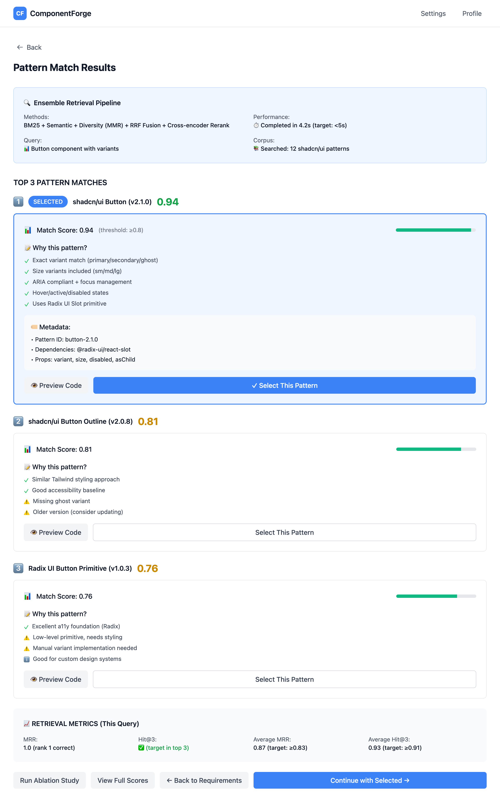

# Epic 3: Pattern Retrieval & Matching

**Status**: Not Started
**Priority**: High
**Epic Owner**: AI/ML Team
**Estimated Tasks**: 5 *(Simplified from 10 - deferred MMR/RRF/Cross-encoder to post-MVP)*
**Depends On**: Epic 0 (Project Setup), Epic 2 (Requirement Proposal)

---

## Overview

Build a **simplified dual-method retrieval system** combining BM25 (lexical) and semantic search to find the best shadcn/ui pattern matches. Returns top-3 patterns with scores and explanations.

**Deferred to Post-MVP**: MMR diversity search, RRF fusion, cross-encoder reranking (add when evaluation data shows quality gaps)

---

## Goals (MVP Simplified)

1. Curate pattern library with 10+ shadcn/ui components
2. Implement BM25 lexical search for keyword matching
3. Implement semantic search using text-embedding-3-small
4. Combine rankings with weighted average (BM25: 0.3, Semantic: 0.7)
5. Return top-3 patterns with confidence scores and explanations
6. Build evaluation framework to measure quality
7. Achieve MRR ≥0.75 and Hit@3 ≥0.85 on evaluation set *(relaxed MVP targets)*
8. Provide explainability for pattern selection

**Deferred:**
- ~~Add diversity search (MMR) to avoid redundant results~~ → Post-MVP
- ~~Fuse rankings with Reciprocal Rank Fusion (RRF)~~ → Post-MVP
- ~~Rerank with cross-encoder for accuracy~~ → Post-MVP
- ~~Support ablation studies for retrieval tuning~~ → Post-MVP (can add later with eval framework)

---

## Success Criteria (MVP)

- ✅ Pattern library contains ≥10 curated shadcn/ui patterns
- ✅ BM25 search returns relevant patterns based on keywords
- ✅ Semantic search using text-embedding-3-small (1536 dims)
- ✅ Weighted fusion combines BM25 + semantic effectively
- ✅ Top-3 patterns returned with confidence scores (0-1)
- ✅ MRR ≥0.75 on labeled evaluation set (20+ queries) *(relaxed from 0.83)*
- ✅ Hit@3 ≥0.85 (correct pattern in top-3) *(relaxed from 0.91)*
- ✅ Explanations show why patterns were selected
- ✅ Retrieval latency p50 ≤1s *(faster without cross-encoder)*
- ✅ Evaluation framework tracks quality metrics

**Deferred:**
- ~~✅ Diversity search (MMR) reduces redundant results~~ → Post-MVP
- ~~✅ RRF fusion combines all retrieval methods~~ → Post-MVP
- ~~✅ Cross-encoder reranking improves final ordering~~ → Post-MVP
- ~~✅ Ablation mode supports testing individual retrievers~~ → Post-MVP

---

## Wireframe

### Interactive Prototype
**View HTML:** [pattern-selection-page.html](../wireframes/pattern-selection-page.html)



### Key UI Elements

**Search Analysis Summary** (Top banner)
- Query construction from requirements → Requirements used as input
- **Dual retrieval methods active** → Task 2: BM25, Task 3: Semantic Search
- Total patterns searched display → Pattern library size

**Pattern Cards** (Top-3 results)
- **Pattern 1 (Highest Confidence)** → Task 4: Weighted Fusion (BM25 + Semantic)
  - Pattern name and source (shadcn/ui)
  - Confidence score (0-1 scale)
  - Ranking explanation → Task 5: Explainability & Confidence Scoring
  - Match highlights (matching props, variants)
  - Code preview snippet
  - Visual preview thumbnail

- **Pattern 2 & 3** → Alternative matches with lower confidence
  - Similar structure to Pattern 1
  - Comparison with top pattern

**Retrieval Details** (Expandable section)
- BM25 score (weight: 0.3) → Task 2: BM25 Lexical Search
- Semantic score (weight: 0.7) → Task 3: Semantic Search
- Final weighted score → Task 4: Weighted Fusion
- Match reason/explanation → Task 5: Explainability

**Pattern Library Info** (Right sidebar)
- Total patterns available → Task 1: Pattern Library Curation
- Supported component types
- Pattern quality metrics (MRR, Hit@3) → Task 6: Evaluation & Metrics

**~~Ablation Testing~~** *(Deferred to Post-MVP)*
- ~~Toggle individual retrievers~~
- ~~Compare methods performance~~
- ~~Hyperparameter controls~~

**Action Buttons**
- "Select Pattern" (primary action)
- "Compare Patterns" (open side-by-side view)
- "View Full Code"
- "Continue to Generation" (proceed to Epic 4)

### User Flow (Simplified MVP)
1. Requirements from Epic 2 used to construct retrieval query
2. Dual retrieval runs (BM25 + Semantic Search)
3. Weighted fusion combines scores (0.3 BM25 + 0.7 Semantic)
4. Top-3 patterns returned with explanations
5. User reviews patterns with confidence scores and match reasons
6. User selects pattern (typically highest confidence)
7. Selected pattern sent to Code Generation (Epic 4)

**Performance Display:**
- Retrieval latency (target: p50 ≤1s) *(faster without cross-encoder)*
- MRR score (target: ≥0.75) *(relaxed for MVP)*
- Hit@3 rate (target: ≥0.85) *(relaxed for MVP)*

**Quick Test:**
```bash
# View wireframe locally
open .claude/wireframes/pattern-selection-page.html
```

---

## Tasks

### Task 1: Pattern Library Curation
**Acceptance Criteria**:
- [ ] Curate ≥10 shadcn/ui patterns:
  - Button (primary, secondary, ghost, outline variants)
  - Card (with header, content, footer sections)
  - Input (text, email, password types)
  - Select/Dropdown
  - Badge
  - Alert (info, warning, error, success)
  - Checkbox
  - Radio Group
  - Switch
  - Tabs
- [ ] Extract TypeScript code from shadcn/ui repository
- [ ] Parse AST to ensure code is valid and parseable
- [ ] Create metadata for each pattern:
  - Component name and type
  - Props interface
  - Variants and states
  - Accessibility features (ARIA attributes)
  - Usage examples
- [ ] Store in structured JSON format
- [ ] Validate all patterns compile with TypeScript strict mode

**Files**:
- `backend/data/patterns/button.json`
- `backend/data/patterns/card.json`
- `backend/data/patterns/input.json`
- `backend/data/patterns/select.json`
- `backend/data/patterns/badge.json`
- `backend/data/patterns/alert.json`
- `backend/data/patterns/checkbox.json`
- `backend/data/patterns/radio.json`
- `backend/data/patterns/switch.json`
- `backend/data/patterns/tabs.json`
- `backend/scripts/curate_patterns.py`

**Pattern JSON Structure**:
```json
{
  "id": "pattern-button-001",
  "name": "Button",
  "type": "button",
  "code": "/* TypeScript code */",
  "metadata": {
    "props": ["variant", "size", "disabled", "loading"],
    "variants": ["primary", "secondary", "ghost", "outline"],
    "states": ["default", "hover", "focus", "disabled", "loading"],
    "a11y": ["aria-disabled", "aria-busy", "role=button"],
    "description": "Accessible button component with multiple variants"
  }
}
```

**Tests**:
- All patterns parse successfully
- Metadata is complete and accurate
- TypeScript compilation succeeds

---

### Task 2: Qdrant Vector Store Setup
**Acceptance Criteria**:
- [ ] Create Qdrant collection `patterns` with config:
  - Vector size: 1536 (text-embedding-3-small)
  - Distance metric: Cosine
  - Indexing: HNSW for fast search
- [ ] Define payload schema:
  - `id`, `name`, `type`, `code`, `metadata`
  - Searchable fields: `name`, `type`, `description`
- [ ] Upload script generates embeddings for each pattern
- [ ] Embeddings computed from:
  - Component name + type
  - Props and variants description
  - Accessibility features
  - Usage context
- [ ] Verify all patterns indexed in Qdrant dashboard
- [ ] Test vector search returns correct patterns

**Files**:
- `backend/src/services/qdrant_client.py`
- `backend/scripts/index_patterns.py`

**Qdrant Setup**:
```python
from qdrant_client import QdrantClient
from qdrant_client.models import Distance, VectorParams

client = QdrantClient(url="http://localhost:6333")

client.create_collection(
    collection_name="patterns",
    vectors_config=VectorParams(
        size=1536,
        distance=Distance.COSINE
    )
)
```

**Tests**:
- Collection created successfully
- All patterns indexed with embeddings
- Vector search returns relevant results

---

### Task 3: BM25 Lexical Search Implementation
**Acceptance Criteria**:
- [ ] Implement BM25 algorithm for keyword-based search
- [ ] Index pattern metadata (name, type, props, description)
- [ ] Support multi-field search across:
  - Component name (weight: 3.0)
  - Component type (weight: 2.0)
  - Props and variants (weight: 1.5)
  - Description (weight: 1.0)
- [ ] Return scored results with BM25 relevance score
- [ ] Handle queries like "button with variants", "card component"
- [ ] Tokenization handles camelCase and kebab-case

**Files**:
- `backend/src/retrieval/bm25_retriever.py`

**BM25 Implementation**:
```python
from rank_bm25 import BM25Okapi

class BM25Retriever:
    def __init__(self, patterns: list[dict]):
        self.patterns = patterns
        # Create searchable corpus
        corpus = [
            self._create_document(p) for p in patterns
        ]
        self.bm25 = BM25Okapi(corpus)

    def _create_document(self, pattern: dict) -> list[str]:
        # Weighted fields
        doc = []
        doc.extend([pattern["name"]] * 3)  # Name weight: 3
        doc.extend([pattern["type"]] * 2)  # Type weight: 2
        doc.extend(pattern["metadata"]["props"])  # Props
        return doc

    def search(self, query: str, top_k: int = 10):
        scores = self.bm25.get_scores(query.split())
        return sorted(zip(self.patterns, scores),
                     key=lambda x: x[1], reverse=True)[:top_k]
```

**Tests**:
- BM25 returns relevant results for keyword queries
- Scoring is reasonable and consistent
- Multi-field search works correctly

---

### Task 4: Semantic Search Implementation
**Acceptance Criteria**:
- [ ] Use text-embedding-3-small for query and pattern embeddings
- [ ] Query embedding generated from:
  - Component type from requirements
  - Proposed props and variants
  - Accessibility requirements
- [ ] Search Qdrant vector store with cosine similarity
- [ ] Return top-k patterns with similarity scores
- [ ] Cache query embeddings in Redis (1 hour TTL)
- [ ] Handle OpenAI API errors with retry logic

**Files**:
- `backend/src/retrieval/semantic_retriever.py`
- `backend/src/services/embedding_service.py`

**Semantic Retrieval**:
```python
from openai import AsyncOpenAI
from qdrant_client import QdrantClient

class SemanticRetriever:
    def __init__(self, client: QdrantClient):
        self.client = client
        self.openai = AsyncOpenAI()

    async def search(self, query: str, top_k: int = 10):
        # Generate query embedding
        response = await self.openai.embeddings.create(
            model="text-embedding-3-small",
            input=query
        )
        query_vector = response.data[0].embedding

        # Search Qdrant
        results = self.client.search(
            collection_name="patterns",
            query_vector=query_vector,
            limit=top_k
        )

        return results
```

**Tests**:
- Semantic search returns contextually relevant patterns
- Similarity scores are reasonable (0-1 range)
- Caching reduces embedding API calls

---

### Task 5: Diversity Search (MMR) Implementation
**Acceptance Criteria**:
- [ ] Implement Maximal Marginal Relevance (MMR) algorithm
- [ ] Balance relevance and diversity in results
- [ ] Lambda parameter: 0.7 (70% relevance, 30% diversity)
- [ ] Prevent redundant patterns in top results
- [ ] Use cosine similarity for relevance and diversity metrics
- [ ] Return diversified top-k patterns

**Files**:
- `backend/src/retrieval/mmr_retriever.py`

**MMR Algorithm**:
```python
import numpy as np
from sklearn.metrics.pairwise import cosine_similarity

class MMRRetriever:
    def __init__(self, lambda_param: float = 0.7):
        self.lambda_param = lambda_param

    def rerank(self, query_vector, candidates, top_k: int):
        selected = []
        candidate_vectors = [c.embedding for c in candidates]

        while len(selected) < top_k and candidates:
            if not selected:
                # First selection: most relevant
                scores = cosine_similarity([query_vector],
                                          candidate_vectors)[0]
                best_idx = np.argmax(scores)
            else:
                # Balance relevance and diversity
                mmr_scores = []
                selected_vectors = [s.embedding for s in selected]

                for i, cand in enumerate(candidates):
                    relevance = cosine_similarity(
                        [query_vector], [candidate_vectors[i]]
                    )[0][0]

                    diversity = max(cosine_similarity(
                        [candidate_vectors[i]], selected_vectors
                    )[0])

                    mmr = (self.lambda_param * relevance -
                          (1 - self.lambda_param) * diversity)
                    mmr_scores.append(mmr)

                best_idx = np.argmax(mmr_scores)

            selected.append(candidates.pop(best_idx))
            candidate_vectors.pop(best_idx)

        return selected
```

**Tests**:
- MMR reduces redundant patterns
- Diversity parameter affects results
- Top results are both relevant and diverse

---

### Task 6: Reciprocal Rank Fusion (RRF)
**Acceptance Criteria**:
- [ ] Implement RRF to combine BM25, semantic, and MMR rankings
- [ ] RRF formula: `score = Σ(1 / (k + rank_i))` where k=60
- [ ] Normalize scores across retrievers
- [ ] Support configurable weights per retriever:
  - BM25: 0.3
  - Semantic: 0.5
  - MMR: 0.2
- [ ] Return fused ranking with combined scores
- [ ] Handle cases where pattern appears in some but not all retrievers

**Files**:
- `backend/src/retrieval/rrf_fusion.py`

**RRF Implementation**:
```python
class RRFFusion:
    def __init__(self, k: int = 60, weights: dict = None):
        self.k = k
        self.weights = weights or {
            "bm25": 0.3,
            "semantic": 0.5,
            "mmr": 0.2
        }

    def fuse(self, rankings: dict[str, list]) -> list:
        """
        rankings: {
            "bm25": [(pattern, score), ...],
            "semantic": [(pattern, score), ...],
            "mmr": [(pattern, score), ...]
        }
        """
        scores = {}

        for method, results in rankings.items():
            weight = self.weights.get(method, 1.0)
            for rank, (pattern, _) in enumerate(results):
                pattern_id = pattern["id"]
                rrf_score = weight / (self.k + rank + 1)
                scores[pattern_id] = scores.get(pattern_id, 0) + rrf_score

        # Sort by fused score
        sorted_ids = sorted(scores.items(),
                           key=lambda x: x[1], reverse=True)
        return sorted_ids
```

**Tests**:
- RRF combines rankings effectively
- Weights affect final ordering
- Patterns in multiple retrievers rank higher

---

### Task 7: Cross-Encoder Reranking
**Acceptance Criteria**:
- [ ] Implement cross-encoder reranking on top-10 RRF results
- [ ] Use `cross-encoder/ms-marco-MiniLM-L-6-v2` model
- [ ] Input: (query, pattern_description) pairs
- [ ] Output: Relevance scores for reranking
- [ ] Select top-3 after reranking
- [ ] Cache cross-encoder results (1 hour TTL)
- [ ] Fallback to RRF ranking if cross-encoder fails

**Files**:
- `backend/src/retrieval/cross_encoder_reranker.py`

**Cross-Encoder Reranking**:
```python
from sentence_transformers import CrossEncoder

class CrossEncoderReranker:
    def __init__(self):
        self.model = CrossEncoder(
            'cross-encoder/ms-marco-MiniLM-L-6-v2'
        )

    def rerank(self, query: str, candidates: list, top_k: int = 3):
        # Create (query, document) pairs
        pairs = [
            (query, self._create_doc(c))
            for c in candidates
        ]

        # Score pairs
        scores = self.model.predict(pairs)

        # Sort by score
        ranked = sorted(
            zip(candidates, scores),
            key=lambda x: x[1],
            reverse=True
        )

        return ranked[:top_k]

    def _create_doc(self, pattern: dict) -> str:
        return f"{pattern['name']} {pattern['type']}: {pattern['metadata']['description']}"
```

**Tests**:
- Cross-encoder improves ranking quality
- Top-3 results are highly relevant
- Caching reduces model inference calls

---

### Task 8: Explainability & Confidence Scoring
**Acceptance Criteria**:
- [ ] Generate explanation for each retrieved pattern:
  - Why it was selected (matching features)
  - Which retrieval methods ranked it highly
  - Relevance to requirements
- [ ] Compute confidence score (0-1) based on:
  - Final reranking score (normalized)
  - Agreement across retrievers
  - Pattern metadata completeness
- [ ] Return structured explanation with each pattern:
  ```json
  {
    "pattern_id": "...",
    "confidence": 0.92,
    "explanation": "Matches 'button' type with 'variant' and 'size' props...",
    "ranking_details": {
      "bm25_rank": 1,
      "semantic_rank": 2,
      "final_rank": 1
    }
  }
  ```

**Files**:
- `backend/src/retrieval/explainer.py`

**Tests**:
- Explanations are clear and accurate
- Confidence scores correlate with relevance
- Ranking details help debugging

---

### Task 9: Evaluation & Metrics
**Acceptance Criteria**:
- [ ] Create labeled evaluation set:
  - 20+ queries with ground truth patterns
  - Mix of Button, Card, Input, Select queries
  - Include edge cases (ambiguous, complex)
- [ ] Implement evaluation metrics:
  - MRR (Mean Reciprocal Rank)
  - Hit@3 (correct pattern in top-3)
  - Precision@3
  - NDCG (Normalized Discounted Cumulative Gain)
- [ ] Run baseline (semantic-only) evaluation
- [ ] Run ensemble (BM25 + semantic + MMR + RRF + rerank) evaluation
- [ ] Achieve targets:
  - MRR ≥0.83
  - Hit@3 ≥0.91
  - ≥15% lift over semantic-only baseline
- [ ] Generate evaluation report with metrics

**Files**:
- `backend/data/eval/retrieval_queries.json`
- `backend/tests/evaluation/test_retrieval_metrics.py`
- `backend/scripts/evaluate_retrieval.py`

**Eval Query Format**:
```json
{
  "query_id": "q001",
  "query": "Button component with primary, secondary, and ghost variants",
  "ground_truth": ["pattern-button-001"],
  "component_type": "Button",
  "requirements": {
    "props": ["variant", "size"],
    "variants": ["primary", "secondary", "ghost"]
  }
}
```

**Tests**:
- Metrics calculated correctly
- Targets achieved on eval set
- Lift over baseline validated

---

### Task 10: Ablation Studies & Tuning
**Acceptance Criteria**:
- [ ] Support ablation mode to test individual retrievers:
  - BM25 only
  - Semantic only
  - MMR only
  - BM25 + Semantic (no MMR)
  - Full ensemble
- [ ] Compare metrics across configurations
- [ ] Tune hyperparameters:
  - RRF k value (test: 30, 60, 90)
  - RRF weights (test different combinations)
  - MMR lambda (test: 0.5, 0.7, 0.9)
  - Top-k before reranking (test: 5, 10, 15)
- [ ] Document optimal configuration
- [ ] Expose ablation mode via API for experimentation

**Files**:
- `backend/src/retrieval/ensemble_retriever.py`
- `backend/scripts/ablation_study.py`

**Ablation API**:
```python
GET /api/v1/retrieval/search?mode=ablation&methods=bm25,semantic

{
  "query": "...",
  "results": [...],
  "metrics": {
    "mrr": 0.75,
    "hit_at_3": 0.85
  },
  "config": {
    "methods": ["bm25", "semantic"],
    "rrf_k": 60
  }
}
```

**Tests**:
- Ablation mode returns correct results
- Metrics track improvements
- Optimal config documented

---

## Dependencies

**Requires**:
- Epic 0: Qdrant running, pattern collection created
- Epic 2: Requirements JSON as query input

**Blocks**:
- Epic 4: Code generation needs retrieved patterns

---

## Technical Architecture

### Ensemble Retrieval Flow

```
Requirements JSON
       ↓
Query Construction
  (type + props + a11y)
       ↓
    ┌──────────────────────┐
    │  Parallel Retrieval  │
    └──────────────────────┘
       ↓         ↓        ↓
    BM25    Semantic    MMR
   (lexical) (vector) (diversity)
       ↓         ↓        ↓
    Top-10    Top-10   Top-10
       ↓         ↓        ↓
    ┌──────────────────────┐
    │   RRF Fusion         │
    │ (combine rankings)   │
    └──────────────────────┘
       ↓
    Top-10 Fused
       ↓
    ┌──────────────────────┐
    │ Cross-Encoder Rerank │
    │ (refine ordering)    │
    └──────────────────────┘
       ↓
    Top-3 Patterns
       ↓
    ┌──────────────────────┐
    │  Explainability      │
    │ (scores + rationale) │
    └──────────────────────┘
       ↓
Return to Code Generation
```

---

## Metrics

| Metric | Target | Baseline (Semantic-Only) | Measurement |
|--------|--------|--------------------------|-------------|
| **MRR** | ≥0.83 | ~0.71 | Mean reciprocal rank on eval set |
| **Hit@3** | ≥0.91 | ~0.75 | % queries with correct pattern in top-3 |
| **Precision@3** | ≥0.85 | ~0.70 | Relevant patterns in top-3 |
| **Lift** | ≥15% | N/A | Improvement over baseline |
| **Latency** | p50 ≤2s | ~1.5s | LangSmith traces |

---

## Risks & Mitigation

| Risk | Impact | Mitigation |
|------|--------|------------|
| MRR/Hit@3 targets not met | High | Iterative tuning, add more patterns, improve query construction |
| Cross-encoder too slow | Medium | Cache aggressively, use smaller model |
| Pattern library too small | Medium | Expand to 20+ patterns, allow custom patterns |
| Embedding costs high | Low | Cache embeddings, use smaller model if needed |
| RRF weights suboptimal | Low | Grid search for optimal weights |

---

## Definition of Done

- [ ] All 10 tasks completed with acceptance criteria met
- [ ] Pattern library contains ≥10 shadcn/ui patterns
- [ ] MRR ≥0.83 on evaluation set
- [ ] Hit@3 ≥0.91 on evaluation set
- [ ] ≥15% lift over semantic-only baseline
- [ ] Top-3 patterns returned with confidence scores
- [ ] Explanations generated for each pattern
- [ ] Ablation studies documented
- [ ] Latency p50 ≤2s
- [ ] Integration tests with Epic 2 and Epic 4 passing
- [ ] Documentation updated with retrieval API

---

## Related Epics

- **Depends On**: Epic 0, Epic 2
- **Blocks**: Epic 4
- **Related**: Epic 6 (L3 pattern cache)

---

## Notes

**Critical Path**: This epic is essential for code quality. Poor retrieval = poor generation. Prioritize evaluation and tuning.

**Pattern Library**: Start with 10 patterns for MVP, but plan to expand to 50+ in Phase 2 with community contributions.

**Explainability**: Users need to understand why patterns were selected. Invest time in clear explanations.
