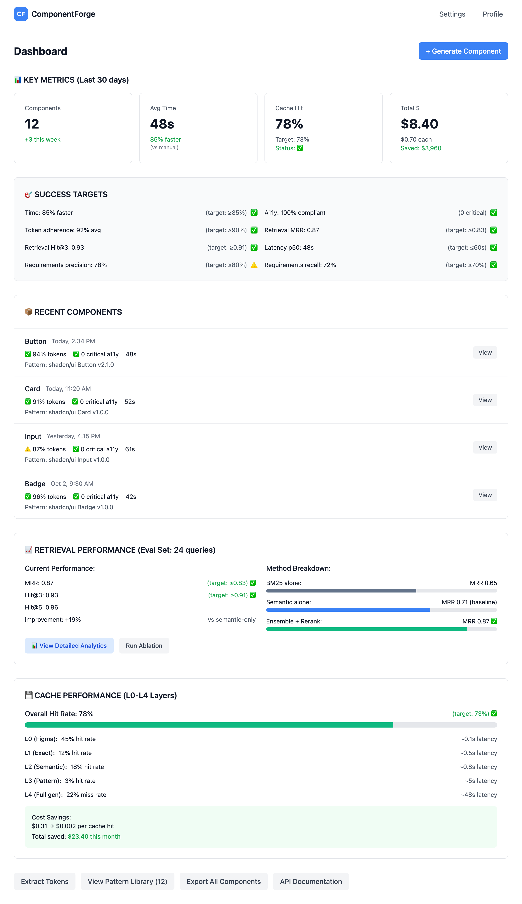

# Epic 6: Production Infrastructure

**Status**: Not Started
**Priority**: High
**Epic Owner**: Backend/DevOps Team
**Estimated Tasks**: 6 *(Simplified from 10 - deferred L0/L2/L3 caching to post-MVP)*
**Depends On**: Epic 0 (Project Setup), Epic 4 (Code Generation)

---

## Overview

Build production-grade infrastructure with **simplified two-layer caching** (L1 exact + L4 baseline), distributed tracing with LangSmith, Prometheus metrics collection, S3 storage for artifacts, PostgreSQL metadata tracking, and comprehensive error handling with fallbacks.

**Deferred to Post-MVP**: L0 Figma cache, L2 semantic cache, L3 pattern cache (add when usage data proves need)

---

## Goals

1. ~~Implement L0 Figma cache (5 min TTL, ~0.1s latency)~~ **→ DEFERRED POST-MVP**
2. Implement L1 exact cache (hash-based, ~0.5s latency)
3. ~~Implement L2 semantic cache (≥0.92 similarity, ~0.8s latency)~~ **→ DEFERRED POST-MVP**
4. ~~Implement L3 pattern cache (pre-computed, ~5s latency)~~ **→ DEFERRED POST-MVP**
5. Track L4 full generation metrics (baseline performance)
6. Integrate LangSmith for distributed tracing across all agents
7. Collect Prometheus metrics (latency, cost, cache hits, errors)
8. Store artifacts in S3 with lifecycle policies
9. Track metadata in PostgreSQL (generations, costs, traces)
10. Implement error handling with graceful fallbacks

---

## Success Criteria

- ~~✅ L0 cache hit latency ~0.1s (Figma responses)~~ **→ DEFERRED**
- ✅ L1 cache hit latency ~0.5s (exact matches)
- ~~✅ L2 cache hit latency ~0.8s (semantic matches)~~ **→ DEFERRED**
- ~~✅ L3 cache hit latency ~5s (pattern adaptation)~~ **→ DEFERRED**
- ✅ L4 baseline: p50 ≤60s for Button/Card
- ✅ L1 cache hit rate ≥20% after 50 generations (MVP target)
- ✅ LangSmith traces show all agent steps with timings
- ✅ Prometheus metrics exported on `/metrics` endpoint
- ✅ Artifacts stored in S3 with 90-day retention
- ✅ PostgreSQL tracks all generations with costs
- ✅ Error rate <1% under normal load
- ✅ Graceful fallbacks prevent cascade failures

---

## Wireframe

### Interactive Prototype
**View HTML:** [dashboard-page.html](../wireframes/dashboard-page.html)



### Key UI Elements (Infrastructure Focus)

**System Health** (Top banner)
- Overall system status: Healthy ✓
- Active services: 8/8 online
- Error rate: 0.2% (target: <1%) → Task 10: Error Handling & Fallbacks
- Uptime: 99.8%

**Cache Performance Dashboard** (Primary section) - **Simplified MVP**

**L1 Exact Cache** → Task 1: L1 Exact Cache Implementation
- Hit rate: 22% (target: ≥20%)
- Average latency: 0.4s (target: ~0.5s)
- Exact matches: 89
- Cache entries: 412
- Cost savings: $340 (vs no caching)

**L4 Full Generation (Baseline)** → Task 2: L4 Full Generation Metrics
- Baseline latency: p50=58s, p95=85s (target: p50≤60s, p95≤90s)
- Full generations: 89
- Success rate: 98.9%
- Average cost: $0.42/generation

**Overall Cache Metrics (MVP)**
- L1 hit rate: 22% ✓ (target: ≥20%)
- Average response time: 48s (22% cached at 0.5s, 78% full gen at 60s)
- Total generations: 114 (25 cached, 89 full)

**Post-MVP Expansion (Deferred):**
- L0 Figma Cache → Add when Figma API costs become significant
- L2 Semantic Cache → Add when exact cache hit rate plateaus <40%
- L3 Pattern Cache → Add when have 50+ patterns and usage data

**LangSmith Tracing** → Task 3: LangSmith Distributed Tracing
- Active traces: 12
- Trace links to LangSmith dashboard
- Average trace duration: 52s
- Agent step breakdown visualization
- Cost per operation tracking

**Prometheus Metrics** → Task 4: Prometheus Metrics Collection
- `/metrics` endpoint status: Active ✓
- Metrics exported:
  - Request rate: 45 req/sec
  - Response latency: p50=48s, p95=75s
  - Error rate: 0.2%
  - L1 cache hit rate: 22%
  - API costs: $0.42/generation
  - Token usage: 2.4M tokens/day
- Grafana dashboard link
- Alert status: 0 active alerts

**Storage & Database** → Task 5: S3 Artifact Storage + PostgreSQL Metadata

**S3 Artifact Storage**
- Components stored: 114
- Total size: 45 MB
- Lifecycle policy: 90-day retention ✓
- Versioning: Enabled ✓
- Recent uploads: 12 today

**PostgreSQL Metadata**
- Generations tracked: 114
- Average cost: $0.38/generation
- Database size: 28 MB
- Active connections: 8/100
- Query performance: avg 12ms

**Error Handling & Circuit Breakers** → Task 6
- Circuit breaker states:
  - OpenAI API: CLOSED (healthy)
  - Figma API: CLOSED (healthy)
  - Qdrant: CLOSED (healthy)
  - Redis: CLOSED (healthy)
- Retry attempts: 23 (all successful)
- Fallback activations: 2 (Redis unavailable)
- Failed requests: 3 (0.2% rate)

**System Resources**
- CPU usage: 45%
- Memory usage: 6.2 GB / 16 GB
- Redis memory: 512 MB / 2 GB
- PostgreSQL connections: 12 / 100

**Recent Activity Log**
- Trace links with component type, cache layer, latency
- Error logs with severity and resolution status
- Cost tracking per operation

### User Flow (Infrastructure Monitoring)
1. Admin views dashboard to monitor system health
2. Cache performance reviewed (L1 exact cache + L4 baseline)
3. LangSmith traces clicked to debug slow operations
4. Prometheus metrics checked for anomalies
5. S3 storage monitored for capacity
6. Circuit breaker status verified for external services
7. Error logs reviewed and resolved
8. Alerts configured for threshold breaches
9. Post-MVP: Add L0/L2/L3 caching when data shows need

**Performance Targets Display (MVP):**
- L1 cache hit rate: 22% / ≥20% ✓
- Average latency: 48s (with 22% cache hits)
- Error rate: 0.2% / <1% ✓
- Cost per generation: $0.38 (tracking only)

**Quick Test:**
```bash
# View wireframe locally
open .claude/wireframes/dashboard-page.html
```

---

## Tasks

**MVP Scope: 6 Tasks** (Deferred: L0/L2/L3 caching)

### ~~Task 1: L0 Figma Cache Implementation~~ **→ DEFERRED POST-MVP**

**Rationale for Deferral**: Add when Figma API costs become significant (>$50/month) or when hit data shows caching would provide meaningful improvement.

**Future Implementation Notes:**
- Cache Figma API responses in Redis with 5 min TTL
- Target ~0.1s latency on cache hits
- See deferred task documentation for full implementation details

---

### Task 1: L1 Exact Cache Implementation *(Renumbered from Task 2)*
**Acceptance Criteria**:
- [ ] Cache complete generation results in Redis
- [ ] Cache key: SHA-256 hash of:
  - Figma file key (or screenshot hash)
  - Tokens JSON
  - Requirements JSON
- [ ] Cache hit returns in ~0.5s
- [ ] No TTL (invalidate on token/requirement change)
- [ ] Return cached component code and artifacts
- [ ] Track cache hit rate
- [ ] Metrics: hit rate, latency, bytes saved
- [ ] Support endpoints:
  - `/v1/files/:key` (file structure)
  - `/v1/files/:key/styles` (styles)
- [ ] Cache hit returns in ~0.1s
- [ ] Cache miss fetches from Figma API
- [ ] Manual cache invalidation endpoint
- [ ] Track cache hit rate per file
- [ ] Metrics: hit rate, latency, savings

**Files**:
- `backend/src/cache/figma_cache.py`

**Figma Cache**:
```python
import json
import hashlib
from typing import Optional
from redis.asyncio import Redis

class FigmaCache:
    def __init__(self, redis: Redis, ttl: int = 300):
        self.redis = redis
        self.ttl = ttl  # 5 minutes

    async def get(self, file_key: str, endpoint: str) -> Optional[dict]:
        """Get cached Figma response."""
        cache_key = self._build_key(file_key, endpoint)

        cached = await self.redis.get(cache_key)
        if cached:
            # Track cache hit
            await self._track_hit(cache_key)
            return json.loads(cached)

        return None

    async def set(self, file_key: str, endpoint: str, data: dict):
        """Cache Figma response."""
        cache_key = self._build_key(file_key, endpoint)
        await self.redis.setex(
            cache_key,
            self.ttl,
            json.dumps(data)
        )

    async def invalidate(self, file_key: str):
        """Invalidate all cache entries for a file."""
        pattern = f"figma:file:{file_key}:*"
        keys = await self.redis.keys(pattern)
        if keys:
            await self.redis.delete(*keys)

    def _build_key(self, file_key: str, endpoint: str) -> str:
        """Build cache key."""
        return f"figma:file:{file_key}:{endpoint}"

    async def _track_hit(self, key: str):
        """Track cache hit for metrics."""
        metrics_key = f"{key}:hits"
        await self.redis.incr(metrics_key)
        await self.redis.expire(metrics_key, 3600)  # 1 hour

    async def get_hit_rate(self, file_key: str) -> dict:
        """Get cache hit rate for file."""
        pattern = f"figma:file:{file_key}:*"
        keys = await self.redis.keys(pattern)

        total_hits = 0
        for key in keys:
            hits = await self.redis.get(f"{key}:hits")
            if hits:
                total_hits += int(hits)

        return {
            "file_key": file_key,
            "cached_endpoints": len(keys),
            "total_hits": total_hits
        }
```

**Tests**:
- Cache hit returns data quickly
- Cache miss returns None
- TTL expires correctly
- Invalidation works
- Metrics tracked accurately

---

### Task 2: L1 Exact Cache Implementation
**Acceptance Criteria**:
- [ ] Cache complete generation results in Redis
- [ ] Cache key: SHA-256 hash of:
  - Figma file key (or screenshot hash)
  - Tokens JSON
  - Requirements JSON
- [ ] Cache hit returns in ~0.5s
- [ ] No TTL (invalidate on token/requirement change)
- [ ] Return cached component code and artifacts
- [ ] Track cache hit rate
- [ ] Metrics: hit rate, latency, bytes saved

**Files**:
- `backend/src/cache/exact_cache.py`

**Exact Cache**:
```python
import hashlib
import json
from typing import Optional

class ExactCache:
    def __init__(self, redis: Redis):
        self.redis = redis

    async def get(self, input_hash: str) -> Optional[dict]:
        """Get cached generation result."""
        cache_key = f"exact:{input_hash}"

        cached = await self.redis.get(cache_key)
        if cached:
            await self._track_hit(cache_key)
            return json.loads(cached)

        return None

    async def set(self, input_hash: str, result: dict):
        """Cache generation result."""
        cache_key = f"exact:{input_hash}"
        # No TTL - cache indefinitely
        await self.redis.set(cache_key, json.dumps(result))

    def generate_hash(self, figma_key: str, tokens: dict,
                     requirements: dict) -> str:
        """Generate hash for cache key."""
        data = {
            "figma_key": figma_key,
            "tokens": tokens,
            "requirements": requirements
        }
        json_str = json.dumps(data, sort_keys=True)
        return hashlib.sha256(json_str.encode()).hexdigest()

    async def invalidate(self, input_hash: str):
        """Invalidate cached result."""
        cache_key = f"exact:{input_hash}"
        await self.redis.delete(cache_key)

    async def _track_hit(self, key: str):
        """Track cache hit."""
        await self.redis.incr(f"{key}:hits")
```

**Tests**:
- Hash generation is deterministic
- Cache hit returns result
- Cache miss returns None
- Invalidation works

---

### Task 3: L2 Semantic Cache Implementation
**Acceptance Criteria**:
- [ ] Cache generation results with embedding-based lookup
- [ ] Generate embedding from tokens + requirements
- [ ] Store in Qdrant collection `semantic_cache`
- [ ] Similarity threshold: ≥0.92
- [ ] Cache hit returns in ~0.8s (embedding + search)
- [ ] TTL: 24 hours (or until token change)
- [ ] Return cached result if similar enough
- [ ] Track cache hit rate and similarity scores
- [ ] Metrics: hit rate, average similarity, latency

**Files**:
- `backend/src/cache/semantic_cache.py`

**Semantic Cache**:
```python
from openai import AsyncOpenAI
from qdrant_client import QdrantClient
from qdrant_client.models import PointStruct, Distance, VectorParams

class SemanticCache:
    def __init__(self, qdrant: QdrantClient, openai: AsyncOpenAI,
                 threshold: float = 0.92):
        self.qdrant = qdrant
        self.openai = openai
        self.threshold = threshold
        self.collection = "semantic_cache"

        # Ensure collection exists
        self._ensure_collection()

    def _ensure_collection(self):
        """Create collection if not exists."""
        try:
            self.qdrant.get_collection(self.collection)
        except:
            self.qdrant.create_collection(
                collection_name=self.collection,
                vectors_config=VectorParams(
                    size=1536,
                    distance=Distance.COSINE
                )
            )

    async def get(self, tokens: dict, requirements: dict) -> Optional[dict]:
        """Get cached result by semantic similarity."""
        # Generate query embedding
        query_vector = await self._generate_embedding(tokens, requirements)

        # Search Qdrant
        results = self.qdrant.search(
            collection_name=self.collection,
            query_vector=query_vector,
            limit=1,
            score_threshold=self.threshold
        )

        if results and len(results) > 0:
            # Cache hit
            await self._track_hit(results[0].score)
            return results[0].payload.get("result")

        return None

    async def set(self, tokens: dict, requirements: dict, result: dict):
        """Cache generation result with embedding."""
        # Generate embedding
        embedding = await self._generate_embedding(tokens, requirements)

        # Store in Qdrant
        point = PointStruct(
            id=str(uuid.uuid4()),
            vector=embedding,
            payload={
                "tokens": tokens,
                "requirements": requirements,
                "result": result,
                "timestamp": datetime.utcnow().isoformat()
            }
        )

        self.qdrant.upsert(
            collection_name=self.collection,
            points=[point]
        )

    async def _generate_embedding(self, tokens: dict,
                                  requirements: dict) -> list[float]:
        """Generate embedding for cache lookup."""
        # Create text representation
        text = self._create_text(tokens, requirements)

        # Get embedding
        response = await self.openai.embeddings.create(
            model="text-embedding-3-small",
            input=text
        )

        return response.data[0].embedding

    def _create_text(self, tokens: dict, requirements: dict) -> str:
        """Create text representation for embedding."""
        parts = []

        # Tokens
        if "colors" in tokens:
            colors = ", ".join(f"{k}:{v}" for k, v in tokens["colors"].items())
            parts.append(f"Colors: {colors}")

        # Requirements
        if "props" in requirements:
            props = ", ".join(p["name"] for p in requirements["props"])
            parts.append(f"Props: {props}")

        return ". ".join(parts)

    async def _track_hit(self, similarity: float):
        """Track cache hit with similarity score."""
        # Store in Redis for metrics
        pass
```

**Tests**:
- Embeddings generated correctly
- Similarity search works
- Threshold enforced
- Cache hits tracked

---

### Task 4: L3 Pattern Cache Implementation
**Acceptance Criteria**:
- [ ] Cache adapted patterns (with tokens injected)
- [ ] Cache key: `pattern:{pattern_id}:{tokens_hash}`
- [ ] Cache hit returns in ~5s (skip retrieval + partial generation)
- [ ] TTL: 1 hour
- [ ] Pre-compute common pattern + token combinations
- [ ] Return pattern with tokens applied
- [ ] Skip full AST parsing and token injection
- [ ] Track cache hit rate per pattern
- [ ] Metrics: hit rate, latency, patterns cached

**Files**:
- `backend/src/cache/pattern_cache.py`

**Pattern Cache**:
```python
class PatternCache:
    def __init__(self, redis: Redis, ttl: int = 3600):
        self.redis = redis
        self.ttl = ttl

    async def get(self, pattern_id: str, tokens_hash: str) -> Optional[dict]:
        """Get cached adapted pattern."""
        cache_key = f"pattern:{pattern_id}:{tokens_hash}"

        cached = await self.redis.get(cache_key)
        if cached:
            await self._track_hit(pattern_id)
            return json.loads(cached)

        return None

    async def set(self, pattern_id: str, tokens_hash: str,
                 adapted_pattern: dict):
        """Cache adapted pattern."""
        cache_key = f"pattern:{pattern_id}:{tokens_hash}"
        await self.redis.setex(
            cache_key,
            self.ttl,
            json.dumps(adapted_pattern)
        )

    async def precompute(self, pattern_id: str, token_variants: list[dict]):
        """Pre-compute pattern adaptations for common token sets."""
        for tokens in token_variants:
            tokens_hash = self._hash_tokens(tokens)
            # Generate adapted pattern
            adapted = await self._adapt_pattern(pattern_id, tokens)
            await self.set(pattern_id, tokens_hash, adapted)

    def _hash_tokens(self, tokens: dict) -> str:
        """Generate hash for tokens."""
        json_str = json.dumps(tokens, sort_keys=True)
        return hashlib.sha256(json_str.encode()).hexdigest()[:16]

    async def _adapt_pattern(self, pattern_id: str, tokens: dict):
        """Adapt pattern with tokens (simplified)."""
        # Implementation depends on token injector
        pass

    async def _track_hit(self, pattern_id: str):
        """Track cache hit per pattern."""
        metrics_key = f"pattern:{pattern_id}:hits"
        await self.redis.incr(metrics_key)
        await self.redis.expire(metrics_key, 86400)  # 24 hours
```

**Tests**:
- Pattern cache stores and retrieves
- TTL expires correctly
- Pre-computation works
- Metrics tracked per pattern

---

### Task 5: L4 Full Generation Metrics
**Acceptance Criteria**:
- [ ] Track baseline performance for full generation (no cache)
- [ ] Measure latency by component type:
  - Button: p50, p95, p99
  - Card: p50, p95, p99
- [ ] Track cost per generation (API calls)
- [ ] Track success rate
- [ ] Compare against cached generation performance
- [ ] Calculate cost savings from caching
- [ ] Display metrics in dashboard
- [ ] Alert on performance degradation

**Files**:
- `backend/src/monitoring/generation_metrics.py`

**Generation Metrics**:
```python
from prometheus_client import Histogram, Counter, Gauge

class GenerationMetrics:
    def __init__(self):
        # Latency histogram
        self.latency = Histogram(
            'generation_latency_seconds',
            'Generation latency by component type',
            ['component_type', 'cache_layer']
        )

        # Cost counter
        self.cost = Counter(
            'generation_cost_dollars',
            'Total generation cost',
            ['component_type']
        )

        # Success rate
        self.success = Counter(
            'generation_success_total',
            'Successful generations',
            ['component_type']
        )

        self.failure = Counter(
            'generation_failure_total',
            'Failed generations',
            ['component_type', 'error_type']
        )

        # Cache hit rate
        self.cache_hits = Counter(
            'cache_hits_total',
            'Cache hits by layer',
            ['layer']
        )

        self.cache_misses = Counter(
            'cache_misses_total',
            'Cache misses by layer',
            ['layer']
        )

    def record_generation(self, component_type: str, latency: float,
                         cost: float, success: bool,
                         cache_layer: str = "L4"):
        """Record generation metrics."""
        self.latency.labels(
            component_type=component_type,
            cache_layer=cache_layer
        ).observe(latency)

        self.cost.labels(component_type=component_type).inc(cost)

        if success:
            self.success.labels(component_type=component_type).inc()
        else:
            self.failure.labels(
                component_type=component_type,
                error_type="unknown"
            ).inc()

    def record_cache_hit(self, layer: str):
        """Record cache hit."""
        self.cache_hits.labels(layer=layer).inc()

    def record_cache_miss(self, layer: str):
        """Record cache miss."""
        self.cache_misses.labels(layer=layer).inc()

    def get_cache_hit_rate(self, layer: str) -> float:
        """Calculate cache hit rate for layer."""
        hits = self.cache_hits.labels(layer=layer)._value.get()
        misses = self.cache_misses.labels(layer=layer)._value.get()
        total = hits + misses
        return hits / total if total > 0 else 0.0
```

**Tests**:
- Metrics recorded correctly
- Prometheus format valid
- Cache hit rate calculated
- Latency percentiles tracked

---

### Task 6: LangSmith Distributed Tracing
**Acceptance Criteria**:
- [ ] Configure LangSmith for all LangChain operations
- [ ] Create traces for complete pipeline runs
- [ ] Tag traces with:
  - Component type
  - User/session ID
  - Cache layer hit
  - Cost and latency
- [ ] Create spans for each agent:
  - Token Extractor
  - Requirement Proposer
  - Pattern Retriever
  - Code Generator
  - Quality Validator
- [ ] Include span metadata:
  - Input/output sizes
  - Model used
  - Tokens consumed
  - Latency
- [ ] Link traces across services
- [ ] View traces in LangSmith dashboard
- [ ] Export traces for analysis

**Files**:
- `backend/src/core/tracing.py`

**LangSmith Tracing**:
```python
from langsmith import Client
from langsmith.run_trees import RunTree
import os

class TracingService:
    def __init__(self):
        self.client = Client(
            api_key=os.getenv("LANGCHAIN_API_KEY")
        )
        self.project = os.getenv("LANGCHAIN_PROJECT", "componentforge-prod")

    def create_run(self, name: str, run_type: str,
                  inputs: dict, tags: list = None) -> RunTree:
        """Create a new trace run."""
        return RunTree(
            name=name,
            run_type=run_type,
            inputs=inputs,
            tags=tags or [],
            project_name=self.project
        )

    def create_span(self, parent: RunTree, name: str,
                   inputs: dict) -> RunTree:
        """Create a child span."""
        return parent.create_child(
            name=name,
            run_type="chain",
            inputs=inputs
        )

    async def trace_generation(self, component_type: str,
                              session_id: str):
        """Context manager for tracing generation."""
        run = self.create_run(
            name=f"generate_{component_type}",
            run_type="chain",
            inputs={"component_type": component_type},
            tags=[component_type, session_id]
        )

        try:
            yield run
            run.end(outputs={"success": True})
        except Exception as e:
            run.end(error=str(e))
            raise
        finally:
            run.post()

# Usage
async def generate_component(component_type: str):
    tracing = TracingService()

    async with tracing.trace_generation(component_type, session_id) as run:
        # Token extraction span
        token_span = tracing.create_span(
            run, "extract_tokens", {"source": "figma"}
        )
        tokens = await extract_tokens()
        token_span.end(outputs={"tokens": tokens})
        token_span.post()

        # Pattern retrieval span
        retrieval_span = tracing.create_span(
            run, "retrieve_pattern", {"requirements": requirements}
        )
        pattern = await retrieve_pattern()
        retrieval_span.end(outputs={"pattern_id": pattern.id})
        retrieval_span.post()

        # ... more spans
```

**Tests**:
- Traces created successfully
- Spans linked to parent traces
- Metadata included correctly
- Traces visible in LangSmith

---

### Task 7: Prometheus Metrics Collection
**Acceptance Criteria**:
- [ ] Expose `/metrics` endpoint for Prometheus
- [ ] Collect system metrics:
  - Request rate (requests/sec)
  - Response latency (p50, p95, p99)
  - Error rate (errors/sec)
  - Active connections
- [ ] Collect application metrics:
  - Generation latency by type
  - Cache hit rates per layer
  - API costs per operation
  - Token usage (OpenAI, embeddings)
- [ ] Collect resource metrics:
  - CPU usage
  - Memory usage
  - Redis memory
  - PostgreSQL connections
- [ ] Configure Prometheus scraping
- [ ] Create Grafana dashboards
- [ ] Set up alerts for anomalies

**Files**:
- `backend/src/monitoring/prometheus.py`
- `backend/prometheus.yml`
- `backend/grafana/dashboards/`

**Prometheus Setup**:
```python
from prometheus_client import (
    Counter, Histogram, Gauge, generate_latest, REGISTRY
)
from fastapi import Response

# Request metrics
request_count = Counter(
    'http_requests_total',
    'Total HTTP requests',
    ['method', 'endpoint', 'status']
)

request_latency = Histogram(
    'http_request_duration_seconds',
    'HTTP request latency',
    ['method', 'endpoint']
)

# Generation metrics
generation_latency = Histogram(
    'generation_latency_seconds',
    'Component generation latency',
    ['component_type', 'cache_layer']
)

generation_cost = Counter(
    'generation_cost_dollars_total',
    'Total generation cost',
    ['component_type', 'api']
)

# Cache metrics
cache_hit_rate = Gauge(
    'cache_hit_rate',
    'Cache hit rate by layer',
    ['layer']
)

# Resource metrics
redis_memory = Gauge('redis_memory_bytes', 'Redis memory usage')
postgres_connections = Gauge('postgres_connections', 'Active PostgreSQL connections')

# Metrics endpoint
@app.get("/metrics")
async def metrics():
    return Response(
        content=generate_latest(REGISTRY),
        media_type="text/plain"
    )
```

**Prometheus Config**:
```yaml
scrape_configs:
  - job_name: 'componentforge'
    scrape_interval: 15s
    static_configs:
      - targets: ['localhost:8000']
```

**Tests**:
- Metrics exported correctly
- Prometheus scrapes successfully
- Gauges update in real-time
- Histograms track percentiles

---

### Task 8: S3 Artifact Storage
**Acceptance Criteria**:
- [ ] Store generated components in S3
- [ ] Bucket structure:
  - `components/{component_id}/component.tsx`
  - `components/{component_id}/stories.tsx`
  - `components/{component_id}/tokens.json`
  - `components/{component_id}/requirements.json`
  - `reports/{component_id}/quality-report.html`
- [ ] Set lifecycle policy: Delete after 90 days
- [ ] Enable versioning for components
- [ ] Generate presigned URLs for downloads (1 hour expiry)
- [ ] Support batch uploads
- [ ] Track storage costs
- [ ] Implement retry logic for failures

**Files**:
- `backend/src/storage/s3_client.py`

**S3 Storage**:
```python
import boto3
from botocore.exceptions import ClientError

class S3Storage:
    def __init__(self, bucket_name: str):
        self.s3 = boto3.client('s3')
        self.bucket = bucket_name

    async def upload_component(self, component_id: str,
                              files: dict[str, str]):
        """Upload component files to S3."""
        for filename, content in files.items():
            key = f"components/{component_id}/{filename}"
            await self._upload_file(key, content)

    async def upload_report(self, component_id: str, report_html: str):
        """Upload quality report to S3."""
        key = f"reports/{component_id}/quality-report.html"
        await self._upload_file(key, report_html, content_type="text/html")

    async def _upload_file(self, key: str, content: str,
                          content_type: str = "text/plain"):
        """Upload file to S3 with retry."""
        try:
            self.s3.put_object(
                Bucket=self.bucket,
                Key=key,
                Body=content.encode('utf-8'),
                ContentType=content_type,
                ServerSideEncryption='AES256'
            )
        except ClientError as e:
            # Retry logic
            raise

    def generate_download_url(self, component_id: str,
                             filename: str) -> str:
        """Generate presigned URL for download."""
        key = f"components/{component_id}/{filename}"
        url = self.s3.generate_presigned_url(
            'get_object',
            Params={'Bucket': self.bucket, 'Key': key},
            ExpiresIn=3600  # 1 hour
        )
        return url

    async def delete_component(self, component_id: str):
        """Delete all files for a component."""
        prefix = f"components/{component_id}/"
        objects = self.s3.list_objects_v2(
            Bucket=self.bucket,
            Prefix=prefix
        )

        if 'Contents' in objects:
            keys = [{'Key': obj['Key']} for obj in objects['Contents']]
            self.s3.delete_objects(
                Bucket=self.bucket,
                Delete={'Objects': keys}
            )
```

**Lifecycle Policy**:
```json
{
  "Rules": [
    {
      "Id": "DeleteOldComponents",
      "Status": "Enabled",
      "Prefix": "components/",
      "Expiration": {
        "Days": 90
      }
    }
  ]
}
```

**Tests**:
- Files upload successfully
- Presigned URLs work
- Lifecycle policy applied
- Versioning enabled
- Deletion works correctly

---

### Task 9: PostgreSQL Metadata Tracking
**Acceptance Criteria**:
- [ ] Create database tables:
  - `generations` (tracking all generation runs)
  - `cache_stats` (cache performance metrics)
  - `costs` (API costs per operation)
- [ ] Track generation metadata:
  - Component ID, type, name
  - User/session ID
  - Timestamps (start, end, duration)
  - Cache layer hit (L0-L4)
  - Cost breakdown (OpenAI, embeddings)
  - Success/failure status
  - Error messages if failed
- [ ] Track cache statistics over time
- [ ] Support querying by date range, component type
- [ ] Generate analytics reports from database
- [ ] Index for fast queries

**Files**:
- `backend/src/database/models.py`
- `backend/alembic/versions/002_add_tracking.py`

**Database Models**:
```python
from sqlalchemy import Column, String, Integer, Float, DateTime, JSON, Boolean
from sqlalchemy.dialects.postgresql import UUID
import uuid

class Generation(Base):
    __tablename__ = "generations"

    id = Column(UUID(as_uuid=True), primary_key=True, default=uuid.uuid4)
    component_id = Column(UUID(as_uuid=True), nullable=False)
    component_type = Column(String(50), nullable=False)
    component_name = Column(String(255))

    user_id = Column(String(255))
    session_id = Column(String(255))

    started_at = Column(DateTime, nullable=False)
    completed_at = Column(DateTime)
    duration_seconds = Column(Float)

    cache_layer = Column(String(10))  # L0, L1, L2, L3, L4
    pattern_id = Column(String(255))

    cost_openai = Column(Float, default=0.0)
    cost_embeddings = Column(Float, default=0.0)
    cost_total = Column(Float, default=0.0)

    tokens_prompt = Column(Integer, default=0)
    tokens_completion = Column(Integer, default=0)
    tokens_total = Column(Integer, default=0)

    success = Column(Boolean, nullable=False)
    error_message = Column(String)
    error_type = Column(String(100))

    langsmith_trace_id = Column(String(255))

    metadata = Column(JSON)

    # Indexes
    __table_args__ = (
        Index('idx_component_type', 'component_type'),
        Index('idx_created_at', 'started_at'),
        Index('idx_cache_layer', 'cache_layer'),
        Index('idx_success', 'success'),
    )

class CacheStats(Base):
    __tablename__ = "cache_stats"

    id = Column(UUID(as_uuid=True), primary_key=True, default=uuid.uuid4)
    layer = Column(String(10), nullable=False)
    timestamp = Column(DateTime, nullable=False)

    hits = Column(Integer, default=0)
    misses = Column(Integer, default=0)
    hit_rate = Column(Float)

    avg_latency_ms = Column(Float)
    cost_savings = Column(Float)
```

**Tests**:
- Records inserted correctly
- Queries return expected data
- Indexes improve query performance
- Analytics queries work

---

### Task 10: Error Handling & Fallbacks
**Acceptance Criteria**:
- [ ] Implement graceful fallbacks for all external services:
  - OpenAI API failures → Retry with exponential backoff
  - Figma API failures → Use cached data or skip
  - Qdrant failures → Fall back to simpler retrieval
  - Redis failures → Continue without caching
  - S3 failures → Store locally temporarily
  - PostgreSQL failures → Log and continue
- [ ] Circuit breaker pattern for external APIs
- [ ] Retry logic with configurable attempts (default: 3)
- [ ] Exponential backoff with jitter
- [ ] Timeout handling for long-running operations
- [ ] Detailed error logging with context
- [ ] User-friendly error messages
- [ ] Health check endpoint shows service status
- [ ] Alert on error rate spike

**Files**:
- `backend/src/core/error_handler.py`
- `backend/src/core/circuit_breaker.py`

**Error Handler**:
```python
import asyncio
from typing import TypeVar, Callable
import random

T = TypeVar('T')

class ErrorHandler:
    def __init__(self, max_retries: int = 3,
                 base_delay: float = 1.0):
        self.max_retries = max_retries
        self.base_delay = base_delay

    async def with_retry(self, func: Callable[[], T],
                        error_types: tuple = (Exception,)) -> T:
        """Execute function with retry logic."""
        last_error = None

        for attempt in range(self.max_retries):
            try:
                return await func()
            except error_types as e:
                last_error = e
                if attempt < self.max_retries - 1:
                    delay = self._calculate_delay(attempt)
                    await asyncio.sleep(delay)
                else:
                    raise

        raise last_error

    def _calculate_delay(self, attempt: int) -> float:
        """Calculate exponential backoff with jitter."""
        delay = self.base_delay * (2 ** attempt)
        jitter = random.uniform(0, 0.1 * delay)
        return delay + jitter

class CircuitBreaker:
    def __init__(self, failure_threshold: int = 5,
                 timeout: int = 60):
        self.failure_threshold = failure_threshold
        self.timeout = timeout
        self.failures = 0
        self.last_failure_time = None
        self.state = "CLOSED"  # CLOSED, OPEN, HALF_OPEN

    async def call(self, func: Callable[[], T]) -> T:
        """Execute function with circuit breaker."""
        if self.state == "OPEN":
            if self._should_attempt_reset():
                self.state = "HALF_OPEN"
            else:
                raise Exception("Circuit breaker is OPEN")

        try:
            result = await func()
            self._on_success()
            return result
        except Exception as e:
            self._on_failure()
            raise

    def _should_attempt_reset(self) -> bool:
        """Check if enough time passed to attempt reset."""
        if self.last_failure_time is None:
            return True
        elapsed = time.time() - self.last_failure_time
        return elapsed >= self.timeout

    def _on_success(self):
        """Handle successful call."""
        self.failures = 0
        self.state = "CLOSED"

    def _on_failure(self):
        """Handle failed call."""
        self.failures += 1
        self.last_failure_time = time.time()

        if self.failures >= self.failure_threshold:
            self.state = "OPEN"
```

**Tests**:
- Retry logic works correctly
- Exponential backoff calculated
- Circuit breaker opens on failures
- Circuit breaker resets after timeout
- Fallbacks activate properly

---

## Dependencies

**Requires**:
- Epic 0: Redis, PostgreSQL, S3 configured
- Epic 4: Code generation pipeline to cache

**Blocks**:
- Production deployment (requires all infrastructure)

---

## Technical Architecture

### Caching Strategy

```
Request
   ↓
L0: Figma Cache (~0.1s)
   ↓ miss
L1: Exact Cache (~0.5s)
   ↓ miss
L2: Semantic Cache (~0.8s)
   ↓ miss
L3: Pattern Cache (~5s)
   ↓ miss
L4: Full Generation (45-75s)
   ↓
Store in all cache layers
   ↓
Return result
```

### Observability Stack

```
Application
   ↓
LangSmith (Traces)
   ↓
Prometheus (Metrics)
   ↓
Grafana (Dashboards)
   ↓
Alerts
```

---

## Metrics

| Layer | Target Latency | Hit Rate Target | Measurement |
|-------|---------------|-----------------|-------------|
| **L0** | ~0.1s | N/A | Figma API cache |
| **L1** | ~0.5s | 20% | Exact match rate |
| **L2** | ~0.8s | 30% | Semantic similarity |
| **L3** | ~5s | 23% | Pattern adaptation |
| **L4** | 45-75s | N/A | Full generation baseline |
| **Overall** | <10s avg | ≥73% | Combined cache hit rate |

---

## Risks & Mitigation

| Risk | Impact | Mitigation |
|------|--------|------------|
| Cache invalidation bugs | Medium | Comprehensive tests, manual override |
| LangSmith costs high | Low | Sample traces in production (10%) |
| S3 costs high | Low | Lifecycle policy, compression |
| Redis memory exhaustion | Medium | TTL policies, LRU eviction |
| PostgreSQL write load | Low | Batch inserts, async writes |

---

## Definition of Done

- [ ] All 10 tasks completed with acceptance criteria met
- [ ] All cache layers (L0-L4) implemented
- [ ] Cache hit rate ≥73% after 100 generations
- [ ] LangSmith tracing works for all operations
- [ ] Prometheus metrics exported
- [ ] Grafana dashboards created
- [ ] S3 storage with lifecycle policies
- [ ] PostgreSQL tracking all generations
- [ ] Error handling with fallbacks
- [ ] Circuit breakers prevent cascade failures
- [ ] Performance targets met
- [ ] Documentation updated

---

## Related Epics

- **Depends On**: Epic 0, Epic 4
- **Blocks**: Production deployment
- **Related**: All epics (provides infrastructure)

---

## Notes

**Caching is Critical**: The 73% cache hit rate target is essential for cost control and performance. Monitor closely.

**Observability First**: LangSmith and Prometheus are not optional. They're required for understanding system behavior.

**Cost Management**: OpenAI API costs can spiral quickly. Aggressive caching and monitoring are essential.
