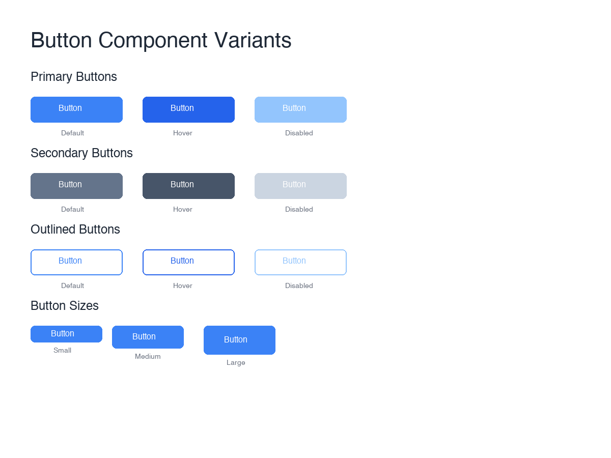
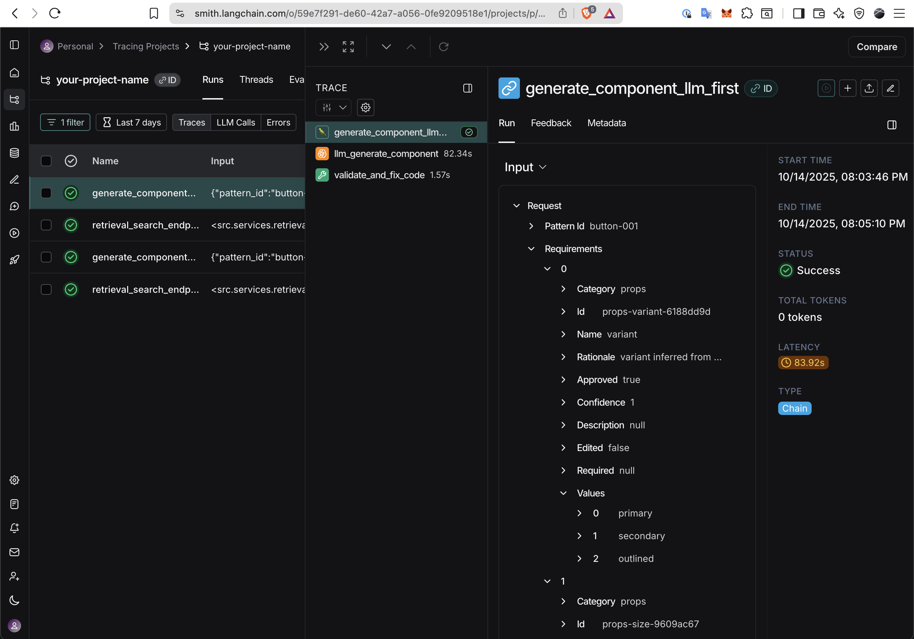

# End-to-End Agentic RAG Application for Design-to-Code Generation

**Project**: ComponentForge
**Technology Stack**: FastAPI, LangGraph, Next.js 15, Qdrant, OpenAI GPT-4/GPT-4V

---

## Task 1: Defining Your Problem and Audience

### Problem Statement (1 sentence)

**Manual conversion of UI designs into production-ready, accessible React components is time-consuming, error-prone, and requires deep knowledge of component libraries, design tokens, and accessibility standards—creating a bottleneck for frontend development teams.**

### Why This is a Problem (1-2 paragraphs)

**For Frontend Developers and Development Teams:**

Frontend developers spend 40-60% of their time translating design mockups and Figma files into code, a largely mechanical process that takes them away from solving complex business logic problems. This process is especially painful when working with design systems like shadcn/ui that have specific patterns, variants, and accessibility requirements. Developers must:

1. **Extract design tokens manually** - Measure colors, spacing, typography from screenshots or Figma
2. **Find appropriate patterns** - Search through component library documentation to find matching patterns
3. **Implement requirements** - Add props, events, states, and accessibility features
4. **Ensure quality** - Validate TypeScript types, ESLint rules, and WCAG compliance
5. **Generate documentation** - Create Storybook stories and usage examples

This repetitive workflow not only slows down feature delivery but also introduces inconsistencies in implementation. Different developers may implement the same design differently, leading to code duplication, maintenance challenges, and accessibility gaps. When design changes occur (which is frequent in agile environments), the entire process must be repeated, wasting valuable engineering resources.

**The business impact is significant**: A mid-size team (10 engineers) can waste 200-300 hours per month on design-to-code translation. This time could be better spent on feature development, performance optimization, or technical debt reduction. Moreover, manual implementation often results in accessibility violations (studies show 70% of websites have WCAG failures), creating legal risks and excluding users with disabilities.

### Target Audience

**Primary Users**: Frontend engineers (React/TypeScript) working with component libraries and custom design systems built on top of shadcn/ui and Radix UI

**Job Functions Automated**:

- Design token extraction from visual assets
- Component pattern research and selection
- Requirement analysis and prop/event definition
- Accessibility implementation (ARIA attributes, keyboard navigation)
- Quality validation (TypeScript, ESLint, axe-core)
- Documentation generation (Storybook stories)

### Questions Users Ask

1. **Pattern Discovery**: "Which shadcn/ui component pattern best matches this design?"
2. **Token Extraction**: "What are the exact colors, spacing, and typography values in this screenshot?"
3. **Requirements**: "What props, variants, and states does this component need?"
4. **Accessibility**: "What ARIA attributes and keyboard interactions are required for WCAG AA?"
5. **Implementation**: "How do I implement this Button with variant prop and 3 states in TypeScript?"
6. **Quality**: "Does my generated component pass TypeScript strict mode and axe-core tests?"
7. **Regeneration**: "The design changed—how do I regenerate just the updated parts?"

---

## Task 2: Proposing a Solution

### Live Demo

[Loom Video](https://www.loom.com/share/4ea3f116df1945d1b54f3cb96eb85d87?sid=fc647a7d-592a-45bb-b8fc-9652449554f7)

### Solution Overview (1-2 paragraphs)

**ComponentForge transforms the design-to-code workflow from hours to seconds** by automating the entire pipeline with AI-powered agents. A developer uploads a screenshot or provides a Figma URL, and ComponentForge:

1. **Extracts design tokens** using GPT-4V (colors, typography, spacing) with confidence scoring
2. **Analyzes requirements** via a multi-agent orchestrator (props, events, states, accessibility)
3. **Retrieves matching patterns** using hybrid RAG (BM25 + semantic search) from a curated shadcn/ui library
4. **Generates production code** with TypeScript, Tailwind CSS v4, proper imports, and Storybook stories
5. **Validates quality** using TypeScript compiler, ESLint, and axe-core accessibility testing
6. **Delivers ready-to-use components** that pass strict validation and WCAG AA standards

The developer receives a complete component package: `Button.tsx`, `Button.stories.tsx`, design tokens JSON, and a quality report. They can review, edit requirements, and regenerate with one click. **The result: ~30 minute tasks reduced to 1-2 minutes, with better quality and consistency than manual implementation.**

### Technology Stack & Tooling Choices

#### LLM: OpenAI GPT-4 & GPT-4V

**Choice**: GPT-4 for text generation, GPT-4V for vision/screenshot analysis

**Why**:

- **GPT-4V excels at visual token extraction**: Can accurately identify colors, typography, spacing from screenshots with ~85-92% confidence
- **GPT-4's code generation quality**: Produces TypeScript code that compiles in strict mode with minimal errors
- **Reasoning capabilities**: Understands component semantics (e.g., "this is a destructive action button" → suggests `variant="destructive"`)
- **Accessibility knowledge**: Generates appropriate ARIA attributes based on component context
- **Established API with reliability**: 99.9% uptime, predictable latency, and cost

**Implementation**: `backend/src/agents/token_extractor.py`, `backend/src/agents/component_classifier.py`

#### Embedding Model: text-embedding-3-small

**Choice**: OpenAI text-embedding-3-small (1536 dimensions)

**Why**:

- **Optimized for semantic search**: Cosine similarity scores accurately rank component pattern relevance
- **Fast inference**: <100ms latency for query embeddings
- **Cost-effective**: $0.00002 per 1K tokens (vs. $0.0001 for text-embedding-3-large)
- **Sufficient dimensionality**: 1536 dims capture component semantics well
- **Native integration**: Direct OpenAI API support without external dependencies

**Implementation**: `backend/src/retrieval/semantic_retriever.py:52-74` (embedding generation with retry logic)

#### Orchestration: LangGraph Multi-Agent System

**Choice**: LangGraph (LangChain's graph-based orchestration framework)

**Why**:

- **State management**: Shared state (`RequirementState`) passed between agents eliminates brittle message passing
- **Parallel execution**: Can run 4 requirement proposers concurrently, reducing latency from 15s (sequential) to 5s
- **Observability**: Native LangSmith integration for distributed tracing of agent workflows
- **Flexibility**: Easy to add/remove agents or modify graph structure without breaking existing flows
- **Error handling**: Built-in retry and fallback mechanisms for agent failures

**Implementation**: `backend/src/agents/requirement_orchestrator.py:46-233` (orchestrates 5 agents: classifier → 4 proposers in parallel)

#### Vector Database: Qdrant

**Choice**: Qdrant with cosine similarity and HNSW indexing

**Why**:

- **Fast similarity search**: milliseconds for top-10 retrieval on 10+ patterns
- **Metadata filtering**: Can filter by framework (React), library (shadcn/ui), category (form, layout)
- **Easy local development**: Docker container runs on `localhost:6333` with dashboard UI
- **Scalability**: Supports collections with millions of vectors (future-proof for expanded pattern library)
- **Open source**: Self-hostable with Qdrant Cloud option for production

**Implementation**: `backend/src/retrieval/semantic_retriever.py:76-145` (vector search with retry and error handling)

#### Monitoring: LangSmith

**Choice**: LangChain's LangSmith for AI observability

**Why**:

- **Complete trace visibility**: See all agent calls, prompts, responses, latencies, and costs in one dashboard
- **Debugging aid**: Quickly identify which agent is slow or producing incorrect outputs
- **Cost tracking**: Monitor OpenAI API spend per request, per agent, and overall
- **Performance optimization**: Identify bottlenecks (e.g., "Token extraction takes 8s—can we optimize the prompt?")
- **Production monitoring**: Set up alerts for high latency, errors, or cost spikes

**Implementation**: `backend/src/core/tracing.py` with `@traced` decorator on all agent methods

#### Testing Philosophy and Quality Assurance

**Choice**: Comprehensive test coverage across backend (pytest), frontend (Vitest/Playwright), and E2E workflows

**Why Testing Matters**:

- **Production readiness**: Catch regressions before they reach users
- **Confidence in AI outputs**: Validate that LLM-generated code meets quality standards
- **Performance guarantees**: Ensure <60s generation time under production load
- **Accessibility compliance**: Prevent WCAG violations from shipping

**Backend Test Suite** (`backend/tests/`)

- **Unit tests**: Individual component testing (token extraction, pattern matching, code validation)
- **Integration tests**: End-to-end pipeline testing (screenshot → tokens → retrieval → generation → validation)
- **Performance benchmarks**: Latency testing across 20+ iterations to measure p50/p95 response times
- **Domain-specific metrics**:
  - Retrieval accuracy (MRR, Hit@3)
  - Code quality (TypeScript compilation rate, token adherence ≥90%)
  - Generation success rate and failure mode analysis

**Frontend Test Suite** (`app/`)

- **Component tests** (Vitest): Unit testing for UI components, state management, and utility functions
- **E2E tests** (Playwright): Full user workflows through browser automation
- **Accessibility testing** (axe-core): Automated WCAG compliance checks on all components
- **Visual regression**: Screenshot comparison to catch UI breaking changes

**Quality Gates**:

- ✅ 100% TypeScript strict compilation (no `any` types)
- ✅ 0 critical axe-core violations (WCAG AA compliance)

**Implementation**: `backend/tests/`, `app/src/`, `app/e2e/`

#### User Interface: Next.js 15 + shadcn/ui

**Choice**: Next.js 15 App Router with shadcn/ui component library

**What is shadcn/ui?** shadcn/ui is a collection of re-usable React components built on Radix UI primitives and styled with Tailwind CSS. Unlike traditional component libraries (Material-UI, Ant Design), shadcn/ui components are **copied directly into your project** rather than installed as dependencies. This gives developers full ownership and customization control while maintaining consistent patterns. It's become the de facto standard for modern React applications, with over 30,000 GitHub stars and adoption by Vercel, Linear, and Cal.com.

**Why shadcn/ui for ComponentForge?**

- **Server components**: Fast initial page loads with SSR, reducing time-to-interactive
- **Type safety**: TypeScript across frontend and backend ensures end-to-end type checking
- **Component reuse**: Use the same shadcn/ui patterns we're generating—dogfooding our own system
- **Accessibility**: shadcn/ui built on Radix UI primitives with WCAG AA compliance by default
- **Modern DX**: Hot reload, TanStack Query for server state, Zustand for client state

**Implementation**: `app/src/` with Next.js 15.5.4 and shadcn/ui components

#### Optional: Serving & Inference

**Choice**: FastAPI with Uvicorn ASGI server

**Why**:

- **Async support**: Handle multiple generation requests concurrently without blocking
- **Auto-generated docs**: OpenAPI/Swagger UI at `/docs` for API exploration
- **Performance**: Uvicorn provides low-latency HTTP handling
- **Python ecosystem**: Easy integration with AI libraries (LangChain, OpenAI, Pillow)

**Implementation**: `backend/src/main.py`

### Where Agents Are Used

**Agent Architecture**: 5 specialized agents orchestrated by LangGraph

1. **Token Extractor Agent** (`backend/src/agents/token_extractor.py`)

   - **Purpose**: Extract design tokens from screenshots using GPT-4V
   - **Input**: PIL Image (screenshot)
   - **Output**: Colors, typography, spacing with confidence scores
   - **Agentic reasoning**: Analyzes visual context to infer semantic meaning (e.g., "this blue is likely a primary brand color")



2. **Component Classifier Agent** (`backend/src/agents/component_classifier.py`)

   - **Purpose**: Infer component type (Button, Card, Input, etc.)
   - **Input**: Image + optional Figma metadata
   - **Output**: Component type with confidence (e.g., `Button: 0.92`)
   - **Agentic reasoning**: Uses visual cues (shape, text, icons) and Figma layer names to determine component category

3. **Props Proposer Agent** (`backend/src/agents/props_proposer.py`)

   - **Purpose**: Suggest props for the component
   - **Input**: Image, classification, design tokens
   - **Output**: List of props with types and rationale (e.g., `variant: string | "primary" | "secondary" | "ghost"`)
   - **Agentic reasoning**: Infers prop structure from visual variants and common component patterns

4. **Events Proposer Agent** (`backend/src/agents/events_proposer.py`)

   - **Purpose**: Identify required event handlers
   - **Input**: Image, classification
   - **Output**: Event list (e.g., `onClick`, `onChange`, `onHover`)
   - **Agentic reasoning**: Determines interactivity needs based on component type and visual affordances

5. **States Proposer Agent** (`backend/src/agents/states_proposer.py`)

   - **Purpose**: Detect component states
   - **Input**: Image, classification
   - **Output**: State list (e.g., `hover`, `focus`, `disabled`, `loading`)
   - **Agentic reasoning**: Recognizes visual indicators of state (disabled opacity, loading spinners)

6. **Accessibility Proposer Agent** (`backend/src/agents/accessibility_proposer.py`)
   - **Purpose**: Recommend ARIA attributes and keyboard interactions
   - **Input**: Image, classification
   - **Output**: Accessibility requirements (e.g., `aria-label`, `role="button"`, Tab/Enter support)
   - **Agentic reasoning**: Applies WCAG AA standards and best practices based on component semantics

**Orchestration**: `RequirementOrchestrator` (`backend/src/agents/requirement_orchestrator.py`) coordinates agents:

- Sequential: Classifier runs first (needs to determine type before analysis)
- Parallel: 4 proposers run concurrently (independent analyses, reduces latency)
- LangGraph state management: Shared `RequirementState` passed between agents

---

## Task 3: Dealing with the Data

### Data Sources

#### Primary: RAG Pattern Library (shadcn/ui Components)

**Location**: `backend/data/patterns/*.json`

**Content**: 10 curated shadcn/ui component patterns with complete metadata:

- **Button** (`button.json`): 6 variants (default, destructive, outline, secondary, ghost, link), 4 sizes, props, a11y features
- **Card** (`card.json`): Composite component with CardHeader, CardTitle, CardContent, CardFooter
- **Input** (`input.json`): Form input with validation states, label, error message
- **Select** (`select.json`): Dropdown with keyboard navigation
- **Badge** (`badge.json`): Status indicators with variants
- **Alert** (`alert.json`): Notifications with severity levels
- **Checkbox**, **Radio**, **Switch**, **Tabs** (additional patterns)

**Structure of each pattern**:

```json
{
  "id": "shadcn-button",
  "name": "Button",
  "category": "form",
  "description": "A customizable button component with multiple variants and sizes",
  "framework": "react",
  "library": "shadcn/ui",
  "code": "import * as React from \"react\"\n...",  // Full TypeScript implementation
  "metadata": {
    "variants": [...],  // List of variant objects with descriptions
    "sizes": [...],     // Size options with dimensions
    "props": [...],     // Props with types and descriptions
    "a11y": {...},      // Accessibility features and ARIA attributes
    "dependencies": [...], // NPM packages required
    "usage_examples": [...]  // Code snippets for common use cases
  }
}
```

**Why this structure**: Each pattern is a self-contained unit with:

- Complete TypeScript code (no external dependencies beyond the metadata)
- Rich metadata for retrieval matching (props, variants, a11y features)
- Usage examples for prompt enhancement during generation

**Example**: `backend/data/patterns/button.json:1-130` (full Button pattern)

#### Secondary: Exemplars for Generation Context

**Location**: `backend/data/exemplars/{pattern}/`

**Content**: Reference implementations showing "ideal" generated code:

- `backend/data/exemplars/button/input.json` - Design tokens used for this exemplar
- `backend/data/exemplars/button/metadata.json` - Requirements and generation metadata

**Purpose**: Few-shot learning for code generation—shows GPT-4 "here's what a well-generated component looks like"

#### External APIs

**1. OpenAI API**

- **Purpose**: Text generation (GPT-4), vision analysis (GPT-4V), embeddings (text-embedding-3-small)
- **Usage**: All agent prompts, semantic search embeddings, code generation
- **Rate limits**: 10,000 requests/min (Tier 5), 1M tokens/min

**2. Figma API** (Optional/Work in Progress)

- **Purpose**: Extract design tokens directly from Figma files (alternative to screenshots)
- **Usage**: GET `/v1/files/:key` endpoint for styles and components
- **Authentication**: Personal Access Token (PAT) stored in HashiCorp Vault
- **Caching**: Redis cache (5 min TTL) to reduce API calls
- **Implementation**: `backend/src/services/figma_client.py`

### Chunking Strategy

**Strategy**: **Pattern-level chunking** (entire component as one chunk)

**Rationale**:

1. **Atomic units**: Each shadcn/ui component is self-contained—splitting would break semantic meaning
2. **Code context**: TypeScript components need full context (imports, types, props, JSX) to be useful
3. **Metadata coupling**: Props, variants, and a11y features are tightly coupled to the code—separate chunks would lose relationships
4. **Retrieval granularity**: Users search for "Button component" not "Button props" or "Button JSX"—they need the whole pattern
5. **Small corpus**: With only 10-20 patterns, chunk size (2-5KB each) is manageable for embedding models (1536 dims handle this well)

**Alternative considered**: **Multi-field chunking** (separate chunks for code, props, variants)

- **Rejected because**:
  - Would require complex re-ranking to combine chunks back into full patterns
  - Increases retrieval complexity (need to fetch 3+ chunks per pattern)
  - Risk of mismatched chunks if one field updates

**Searchable text generation**: `backend/scripts/seed_patterns.py:156-192`

```python
def create_searchable_text(self, pattern: Dict[str, Any]) -> str:
    """Create searchable text representation of pattern."""
    parts = [
        f"Component: {pattern.get('name', '')}",
        f"Category: {pattern.get('category', '')}",
        f"Description: {pattern.get('description', '')}",
        # ... includes variants, sub-components, a11y features
    ]
    return "\n".join(parts)  # Combined into single chunk for embedding
```

**Chunk size**: Average ~2KB per pattern (manageable for text-embedding-3-small)

---

## Task 4: Building an End-to-End Agentic RAG Prototype

ComponentForge is an **end-to-end agentic RAG application** with a production-grade stack (400+ tests).

### Architecture Overview

#### Note: The Figma-based workflow is WIP.

```
┌──────────────────────────────────────────────────────────────────────────────┐
│                     ComponentForge Agentic RAG Pipeline                      │
└──────────────────────────────────────────────────────────────────────────────┘

┌─────────────┐      ┌──────────────────────────────────────────┐
│   📷 INPUT  │      │         🤖 AGENT ORCHESTRATION           │
│             │      │                                          │
│ Screenshots │──────┤   1️⃣  Token Extractor Agent (GPT-4V)   │
│ Figma Files │      │      ├─ Extract colors, typography      │
│ Design Specs│      │      ├─ Extract spacing, dimensions     │
│             │      │      └─ Output: Design tokens + confidence
│             │      │                                          │
│             │      │   2️⃣  RequirementOrchestrator (LangGraph)│
│             │      │      ├─ Component Classifier Agent      │
│             │      │      │   └─ Infer component type        │
│             │      │      │                                  │
│             │      │      ├─ Props Proposer Agent (parallel) │
│             │      │      ├─ Events Proposer Agent (parallel)│
│             │      │      ├─ States Proposer Agent (parallel)│
│             │      │      └─ A11y Proposer Agent (parallel)  │
│             │      │         └─ Output: Structured requirements
└─────────────┘      └───────────────┬──────────────────────────┘
                                     │
                     ┌───────────────▼──────────────────────────┐
                     │      📐 HYBRID RETRIEVAL SYSTEM          │
                     │                                          │
                     │   3️⃣  QueryBuilder                       │
                     │      └─ Transform requirements → queries │
                     │                                          │
                     │   4️⃣  Parallel Retrieval                 │
                     │      ├─ BM25Retriever (30% weight)      │
                     │      │   ├─ Multi-field weighting       │
                     │      │   └─ Keyword-based ranking       │
                     │      │                                  │
                     │      └─ SemanticRetriever (70% weight)  │
                     │          ├─ OpenAI embeddings (1536d)   │
                     │          ├─ Qdrant vector search        │
                     │          └─ Cosine similarity ranking   │
                     │                                          │
                     │   5️⃣  WeightedFusion                     │
                     │      └─ Combine: 0.3×BM25 + 0.7×semantic│
                     │                                          │
                     │   6️⃣  RetrievalExplainer                 │
                     │      ├─ Confidence scoring              │
                     │      ├─ Match highlights                │
                     │      └─ Output: Top-3 patterns          │
                     └───────────────┬──────────────────────────┘
                                     │
                     ┌───────────────▼──────────────────────────┐
                     │      ✨ CODE GENERATION PIPELINE         │
                     │                                          │
                     │   7️⃣  GeneratorService (GPT-4)           │
                     │      ├─ Parse pattern AST               │
                     │      ├─ Inject design tokens            │
                     │      ├─ Generate Tailwind classes       │
                     │      ├─ Implement requirements          │
                     │      ├─ Add TypeScript types            │
                     │      └─ Resolve imports                 │
                     │                                          │
                     │   8️⃣  CodeValidator                      │
                     │      ├─ TypeScript strict compilation   │
                     │      ├─ ESLint validation               │
                     │      ├─ axe-core accessibility testing  │
                     │      └─ Auto-fix common issues          │
                     │                                          │
                     │   Output: Component.tsx, .stories.tsx,   │
                     │           tokens.json, quality report    │
                     └──────────────────────────────────────────┘

┌─────────────────┐    ┌─────────────────┐    ┌─────────────────┐
│   Frontend      │    │   Backend       │    │   Services      │
│   (Next.js)     │◄──►│   (FastAPI)     │◄──►│   (Docker)      │
│                 │    │                 │    │                 │
│ • Next.js 15    │    │ • LangGraph     │    │ • PostgreSQL    │
│ • shadcn/ui     │    │ • LangSmith     │    │ • Qdrant Vector │
│ • Zustand       │    │ • GPT-4/GPT-4V  │    │ • Redis Cache   │
│ • TanStack      │    │ • OpenAI API    │    │                 │
└─────────────────┘    └─────────────────┘    └─────────────────┘

Key:
🤖 = AI Agent (LLM-powered reasoning)
📐 = Retrieval Component (RAG system)
✨ = Generation & Validation
```

### Complete Pipeline Flow

**1. Input → Token Extraction**

- User uploads screenshot (PNG/JPG, max 10MB) via `/api/v1/tokens/extract`
- `ImageProcessor` validates, resizes, and preprocesses image (`backend/src/services/image_processor.py`)
- `TokenExtractor` agent calls GPT-4V with vision prompt (`backend/src/agents/token_extractor.py`)
- **Output**: Colors (hex), typography (font family, size, weight), spacing (margin, padding), confidence scores

**2. Token Extraction → Requirement Proposal**

- `RequirementOrchestrator` coordinates 5 agents (`backend/src/agents/requirement_orchestrator.py`)
- **Agent 1**: `ComponentClassifier` determines component type (Button, Card, Input, etc.) with confidence
- **Agents 2-5** (parallel): `PropsProposer`, `EventsProposer`, `StatesProposer`, `AccessibilityProposer` analyze requirements
- **Output**: Structured requirements (props, events, states, a11y) with rationales

**3. Requirements → Pattern Retrieval**

- `QueryBuilder` transforms requirements into search queries (`backend/src/retrieval/query_builder.py`)
- **BM25 Retrieval**: Keyword-based search with multi-field weighting (`backend/src/retrieval/bm25_retriever.py`)
  - Name: 3.0x weight
  - Category/Type: 2.0x
  - Props + Variants: 1.5x
  - Description: 1.0x
- **Semantic Retrieval**: Embeddings + Qdrant vector search (`backend/src/retrieval/semantic_retriever.py`)
- **Fusion**: Weighted combination (0.3 BM25 + 0.7 semantic) (`backend/src/retrieval/weighted_fusion.py`)
- **Output**: Top-3 patterns with confidence scores, explanations, and match highlights

**4. Pattern + Requirements → Code Generation**

- `GeneratorService` orchestrates generation stages (`backend/src/generation/generator_service.py`)
  - **Parsing**: AST parse pattern code
  - **Token Injection**: Insert design tokens as CSS variables
  - **Tailwind Generation**: Create utility classes
  - **Requirement Implementation**: Add props, events, states
  - **A11y Enhancement**: Insert ARIA attributes
  - **Type Generation**: Create TypeScript interfaces
  - **Import Resolution**: Add necessary imports
  - **Code Assembly**: Combine all parts into final component
- **Output**: `Component.tsx`, `Component.stories.tsx`, design tokens JSON

**5. Code → Quality Validation**

- `CodeValidator` runs validation suite (`backend/src/generation/code_validator.py`)
  - **TypeScript**: `tsc --noEmit` strict compilation
  - **ESLint**: Lint with TypeScript parser
  - **axe-core**: Accessibility testing in Playwright
  - **Token Adherence**: Calculate alignment with design tokens
- **Auto-fix**: Attempt to fix common issues (missing imports, ARIA attributes)
- **Output**: Quality report with pass/fail and recommendations

### Deployment Architecture

**Development**: Local endpoint (Docker Compose)

```bash
# Start all services
docker-compose up -d   # PostgreSQL, Qdrant, Redis
cd backend && source venv/bin/activate && uvicorn src.main:app --reload  # Port 8000
cd app && npm run dev  # Port 3000
```

**Services**:

- **PostgreSQL 16** (`localhost:5432`): Stores users, documents, generations, audit logs
- **Qdrant** (`localhost:6333`): Vector database for pattern embeddings (1536 dims, cosine similarity)
- **Redis 7** (`localhost:6379`): Cache for Figma responses, session management, rate limiting

### Key Endpoints

**Backend API** (`backend/src/api/v1/routes/`)

- `POST /api/v1/tokens/extract/screenshot` - Extract tokens from screenshot
- `POST /api/v1/requirements/propose` - Generate requirements
- `POST /api/v1/retrieval/search` - Search patterns with RAG
- `POST /api/v1/generation/generate` - Generate component code
- `GET /api/v1/retrieval/library/stats` - Pattern library statistics
- `GET /health` - Health check
- `GET /metrics` - Prometheus metrics

**Documentation**:

- `/docs` - Swagger UI (interactive API docs)
- `/redoc` - ReDoc alternative documentation

### Model Usage

**Commercial Models** (OpenAI via API):

- **GPT-4**: Code generation, requirement analysis
- **GPT-4V**: Screenshot token extraction
- **text-embedding-3-small**: Semantic embeddings

### Integration Points

**LangSmith Tracing**: Every agent call traced with:

- Run name, inputs, outputs, latency, cost
- Parent-child span relationships
- Error traces with stack traces
- **Implementation**: `backend/src/core/tracing.py` with `@traced` decorator



**Monitoring Dashboard**: LangSmith UI shows all runs with filtering, search, and cost analysis

---

## Task 5: Creating a Golden Test Data Set

### Overview

ComponentForge already has comprehensive test coverage (see "Testing Philosophy and Quality Assurance" in Architecture section), including backend unit/integration tests and frontend E2E tests. **Task 5 focuses on RAG-specific evaluation** - measuring retrieval accuracy and code generation quality using domain-specific metrics adapted from the RAGAS framework.

The current implementation demonstrates RAGAS-adapted methodology through a Jupyter notebook for exploratory analysis, while acknowledging that production deployment requires separated architecture with automated E2E testing and LLM-as-judge validation.

**Evaluation Artifact**: [notebooks/evaluation/task5_golden_dataset_rag_evaluation.ipynb](../../notebooks/evaluation/task5_golden_dataset_rag_evaluation.ipynb)

### 5.1 Current Approach: Integrated Notebook Evaluation

#### Test Dataset Design

The evaluation uses **25 labeled test queries** designed to assess different retrieval scenarios:

- **Keyword queries** (10 cases): Direct component names testing exact-match retrieval
- **Semantic queries** (10 cases): Descriptive requirements testing semantic understanding
- **Edge cases** (5 cases): Ambiguous or underspecified inputs testing system robustness

Each test case includes the query, expected pattern ID, expected retrieval rank, and design tokens to enable end-to-end pipeline testing.

#### Metrics: RAGAS Framework Adapted for Code Generation

The evaluation adapts the **RAGAS framework** (originally designed for text-based Q&A RAG systems) to code generation:

| RAGAS Metric          | Code Generation Adaptation                                                    | Target      |
| --------------------- | ----------------------------------------------------------------------------- | ----------- |
| **Context Precision** | Mean Reciprocal Rank (MRR) of correct pattern in retrieval results            | ≥0.75       |
| **Context Recall**    | Hit@K - Percentage of queries where correct pattern appears in top-K results  | Hit@3 ≥0.90 |
| **Faithfulness**      | TypeScript Compilation Rate - Does generated code compile without errors?     | 100%        |
| **Answer Relevancy**  | Design Token Adherence - Does code use specified colors, spacing, typography? | ≥90%        |

#### Statistical Rigor

The evaluation includes:

- **Confidence intervals** (95% CI) for all metrics
- **Query type stratification** to understand performance across keyword/semantic/edge cases
- **Distribution analysis** to identify patterns in retrieval ranking and token adherence
- **Significance testing** to validate performance differences across query types

### 5.2 Critical Limitations and Path to Production

#### 1. Execution Complexity: Notebooks Are Not Production Infrastructure

**Challenge**: The integrated notebook combines execution and analysis in one environment, creating operational fragility.

**Issues**:

- Complex environment setup (backend imports, async/await, Node.js subprocess validators)
- Long sequential execution (25 LLM calls × 30 seconds = 12+ minutes)
- Difficult debugging with limited stack traces and stateful cell execution
- Fragile to kernel restarts (losing progress mid-evaluation)

**Production Alternative for Future Consideration**: Separate execution script (`backend/scripts/run_evaluation.py`) that saves results to JSON, allowing fast notebook analysis without re-running the pipeline.

#### 2. Not True End-to-End Testing: Missing the Full User Workflow

**Challenge**: Current notebook approach tests backend components in isolation, not the complete user experience through the UI.

**What's Missing**:

- Frontend UI interactions (file upload, button clicks, form validation)
- Full integration across all layers (frontend → API → backend → database → vector DB)
- Actual user workflows as they would experience the application
- Visual rendering and UI responsiveness testing

**Production Alternative**: Playwright E2E tests that drive the real application through a browser, capturing the complete user journey from screenshot upload to code download.

#### 3. No Ground Truth Comparison: Missing the Benchmark

**Challenge**: Without reference implementations to compare against, we can't measure quality scores, track improvement over time, or validate that our metrics correlate with human judgment.

**Impact**: Can't answer questions like "Is GPT-4's generated code better than GPT-3.5?" or "Did our prompt engineering improvement actually help?"

**Production Alternative**: Create a curated dataset of 10-15 hand-crafted "perfect" implementations, reviewed by senior developers, to serve as ground truth for LLM-as-judge evaluation.

### 5.3 Recommended Production Evaluation Strategy

#### Three-Tier Architecture for Production

The production evaluation strategy builds on **existing test infrastructure** (backend unit tests, frontend E2E tests—see Architecture section) by adding RAG-specific metrics and analysis:

**Tier 1: Backend Unit Testing** ✅ (Already Implemented - Fastest)

- **Status**: Fully implemented in `backend/tests/`
- **Purpose**: Fast regression detection during development
- **Scope**: Individual component testing (retrieval, generation, validation in isolation)
- **Metrics**: Basic pass/fail, TypeScript compilation, token adherence
- **When**: Every code commit, CI/CD pipeline
- **Trade-off**: Speed over comprehensiveness

**Tier 2: Playwright E2E Testing** ✅ (Already Implemented - Comprehensive)

- **Status**: Fully implemented in `app/e2e/`
- **Purpose**: Test complete user workflow through real application
- **Scope**: Full integration from screenshot upload → token extraction → pattern retrieval → code generation → code download
- **Coverage**: All UI interactions, API calls, database operations, visual rendering, accessibility
- **When**: Before each deployment, CI/CD integration
- **Trade-off**: Comprehensiveness over speed

**Tier 3: RAG-Specific Evaluation** (Task 5 Focus - Advanced Metrics)

- **Status**: Notebook POC implemented, production enhancement recommended
- **Purpose**: Measure retrieval accuracy and code quality with domain-specific metrics
- **Scope**: RAGAS-adapted metrics (MRR, Hit@K), statistical analysis, LLM-as-judge evaluation
- **Enhancement**: Separate execution script + analysis notebook for faster iteration
- **When**: Weekly comprehensive evaluation, monthly quality assessment
- **Trade-off**: Analysis depth over execution control

#### Separation of Concerns Workflow

The recommended workflow **decouples execution from analysis**:

1. **Execution Phase** (Once weekly): Playwright E2E runs 25 test scenarios → Saves `results.json` (12 minutes)
2. **Analysis Phase** (Daily iteration): Notebook loads `results.json` → Computes metrics and visualizations (instant)
3. **Benefit**: Iterate on analysis without re-running expensive LLM calls or E2E workflows

### 5.4 Advanced Evaluation For Future Consideration: LLM as Judge

#### The Ground Truth Challenge

To evaluate semantic accuracy and code quality (not just compilation), we need **reference implementations** to compare against. The LLM-as-judge approach uses a powerful LLM (e.g., GPT-4) to compare generated code against human-crafted "perfect" implementations.

**Ground Truth Dataset Structure**:

- 10-15 hand-crafted reference implementations covering common component patterns
- Each includes: input design screenshot, perfect reference code, design tokens, and documentation explaining why it's the "gold standard"
- Reviewed by senior developers to ensure production-grade quality

**LLM-as-Judge Methodology**:

- Use LangSmith Custom Evaluators to systematically compare generated code against reference implementations
- Evaluate 6 dimensions: structural accuracy, functional correctness, code quality, token adherence, accessibility, and developer experience
- Produces 0-10 scores for each dimension, enabling quantitative tracking over time
- Validates LLM judgments against human ratings to ensure correlation

**Multi-Variation Testing**:
Test system robustness by generating the same component with variations:

- Same component, different color schemes
- Same component, different sizes (small, medium, large)
- Same component, different states (default, hover, disabled, loading)

**Key Benefit**: LLM-as-judge evaluation scales much better than human review while capturing nuanced quality metrics that automated checks miss (e.g., "Is this code maintainable?" or "Would I merge this PR?").

### 5.5 Complete Evaluation Framework

| Level                  | Metrics                              | Speed         | Use Case    |
| ---------------------- | ------------------------------------ | ------------- | ----------- |
| **Level 1: Technical** | MRR, Hit@K, Compilation              | Fast          | CI/CD gates |
| **Level 2: Semantic**  | Structural accuracy, Visual fidelity | Medium        | Weekly eval |
| **Level 3: Quality**   | Code quality, Best practices         | Slow          | Pre-launch  |
| **Level 4: E2E**       | Integration, UI, Performance         | Comprehensive | Pre-deploy  |

### 5.6 Implementation Roadmap

**Phase 1: Foundation** ✅ (Current - Completed)

- RAGAS-adapted metrics for code generation
- Statistical analysis with confidence intervals
- Professional visualization suite
- Integrated notebook POC

**Phase 2: Execution Separation**

- Decouple execution from analysis
- Standalone evaluation script saving results to JSON
- Notebook simplified to analysis-only (instant iteration)

**Phase 3: E2E Testing**

- Playwright test suite covering all 25 test scenarios
- Visual regression testing with screenshot comparison
- CI/CD pipeline integration

**Phase 4: Ground Truth Creation**

- Hand-craft 10-15 reference "perfect" implementations
- Senior developer peer review process
- Documentation of design rationale

**Phase 5: LLM-as-Judge Integration**

- LangSmith custom evaluators for semantic validation
- Calibration against human judgment
- Multi-dimensional scoring (structure, quality, accessibility)

**Phase 6: Continuous Monitoring** (Ongoing)

- Weekly automated E2E evaluation runs
- Monthly LLM-as-judge comprehensive assessment
- Longitudinal tracking of metrics over time
- Regression detection and performance trending

### 5.7 Key Takeaways

**Current POC Demonstrates**:

- ✅ Rigorous RAGAS-adapted methodology
- ✅ Statistical significance testing
- ✅ Professional visualization
- ✅ Self-contained proof-of-concept

**Production Requires**:

- 🎯 Separated execution + analysis
- 🎯 E2E testing through real app
- 🎯 Ground truth references
- 🎯 LLM-as-judge validation
- 🎯 Continuous monitoring

**Testing Strategy Evolution**:

1. **Exploration**: Integrated notebook (current)
2. **Development**: Separated execution + analysis
3. **Production**: E2E + LLM judge + continuous

**Key Insight**:

> The right evaluation strategy depends on the phase. Notebooks excel at exploration but shouldn't be used for execution in production. Separate concerns, automate what matters, and use LLMs to evaluate what humans care about.

### 5.8 Additional Evaluation Dimensions for Future Exploration

The current implementation provides comprehensive coverage of retrieval accuracy (MRR, Hit@K) and functional correctness (TypeScript compilation, token adherence). Drawing from industry research on AI code generation evaluation<sup>1</sup>, several complementary metrics could further enhance the evaluation framework:

#### Code Similarity and Semantic Equivalence

Beyond functional correctness, **syntactic and semantic similarity metrics** can quantify how closely generated code matches reference implementations:

- **CodeBLEU**: Extends traditional BLEU by incorporating Abstract Syntax Tree (AST) structure and data-flow analysis. This metric rewards functionally equivalent code even when variable names or formatting differ, providing a more nuanced similarity score than text-based comparison alone.

- **CodeBERTScore**: Embedding-based semantic similarity using code-specific language models. Research shows this correlates more strongly with human judgment of code quality than surface-level metrics.

**Potential Integration**: Add semantic similarity evaluation to the LLM-as-judge framework (Section 5.4), comparing generated components against reference implementations using both structural (AST) and semantic (embedding) dimensions.

#### Robustness and Consistency: pass@k Evaluation

The **pass@k metric** measures generation reliability by producing k code samples for each test case and calculating the probability that at least one passes all validation tests. For example, pass@3 with k=3 generations at temperature=0.7 captures model variance and robustness beyond single-shot testing.

**Potential Integration**: Extend the golden test dataset (Section 5.1) to include multi-generation analysis, measuring whether the system consistently produces valid code across sampling variations. Target: pass@3 ≥95% for production deployment.

#### Maintainability and Code Quality Scores

While ESLint validation is currently implemented, **quantitative maintainability metrics** provide objective measures of code quality:

- **Cyclomatic Complexity**: Measures code path complexity (target: <10 per function)
- **Code Duplication**: Identifies repeated patterns that should be abstracted
- **SonarQube Quality Scores**: Holistic maintainability grades (A-F scale)
- **Technical Debt Ratio**: Estimated time to fix issues vs. development time

**Potential Integration**: Add SonarQube or similar static analysis to the CodeValidator pipeline (Section 4), generating maintainability reports alongside TypeScript/ESLint validation.

#### Performance Profiling

Generated components could be evaluated for **runtime efficiency** in addition to functional correctness:

- **Initial Render Time**: Measure first paint with React DevTools Profiler (target: <100ms)
- **Re-render Performance**: Track unnecessary re-renders and reconciliation overhead
- **Memory Footprint**: Monitor heap allocation during component lifecycle
- **Bundle Size Impact**: Measure contribution to application bundle (target: <5KB gzipped)

**Potential Integration**: Add optional performance benchmarking tier to the three-tier testing architecture (Section 5.3), running quarterly regression tests on component render efficiency.

#### Security and Vulnerability Analysis

**Static and dynamic security analysis** can prevent vulnerabilities in generated code:

- **Dependency Audits**: `npm audit` or Snyk scanning for known CVEs
- **XSS Prevention**: Detect unsafe patterns (`dangerouslySetInnerHTML` without sanitization)
- **OWASP Compliance**: Check for common web vulnerabilities (injection, broken access control)
- **Accessibility Security**: Ensure ARIA attributes don't create spoofing vulnerabilities

**Potential Integration**: Extend the quality validation pipeline (Section 4, Step 5) to include security scanning, blocking code generation if high/critical vulnerabilities are detected.

#### Continuous Evaluation and CI/CD Integration

While weekly/monthly evaluation cadences are defined (Section 5.6), **automated continuous evaluation** provides faster feedback loops:

- **Pre-commit Hooks**: Fast unit test validation (<30s)
- **PR Quality Gates**: Full evaluation suite must pass before merge
- **Automated Regression Detection**: Alert when metrics drop below thresholds (e.g., MRR <0.75)
- **Historical Dashboards**: Track metric trends over time with anomaly detection
- **Cost Monitoring**: Alert on unexpected OpenAI API spend increases

**Potential Integration**: Enhance Phase 6 (Continuous Monitoring) with GitHub Actions workflows that automatically run the evaluation suite on every pull request, preventing regressions from reaching production.

#### Summary of Complementary Metrics

| Evaluation Dimension | Current Implementation | Complementary Enhancement | Complexity | Value Add |
|---------------------|------------------------|---------------------------|------------|-----------|
| **Functional Correctness** | ✅ TypeScript compilation, token adherence | CodeBLEU, CodeBERTScore similarity | Medium | Quantifies "how similar" not just "does it work" |
| **Robustness** | ✅ Single-shot generation | pass@k multi-generation testing | Low | Measures consistency across sampling |
| **Code Quality** | ✅ ESLint validation | SonarQube maintainability scores | Low | Provides holistic quality grades |
| **Performance** | Not currently measured | Runtime profiling, bundle analysis | Medium | Ensures generated code is efficient |
| **Security** | Not currently measured | Dependency audits, vulnerability scanning | Low | Prevents shipping insecure code |
| **Automation** | ✅ Weekly/monthly cadence | CI/CD integration with PR gates | High | Faster feedback, regression prevention |

These complementary dimensions build upon the rigorous RAGAS-adapted foundation (MRR, Hit@K, compilation rate, token adherence) by adding layers of quality, performance, and security analysis. The current implementation provides strong fundamentals for production deployment; these enhancements offer pathways for continuous improvement as the system matures.

---

**References**

1. Walturn. (2024). "Measuring the Performance of AI Code Generation: A Practical Guide." Retrieved from https://www.walturn.com/insights/measuring-the-performance-of-ai-code-generation-a-practical-guide

---

## Task 6: The Benefits of Advanced Retrieval & Task 7: Assessing Performance

See **Evaluation Artifact**: [notebooks/evaluation/tasks_6_7_consolidated_evaluation.ipynb](../../notebooks/evaluation/tasks_6_7_consolidated_evaluation.ipynb)
